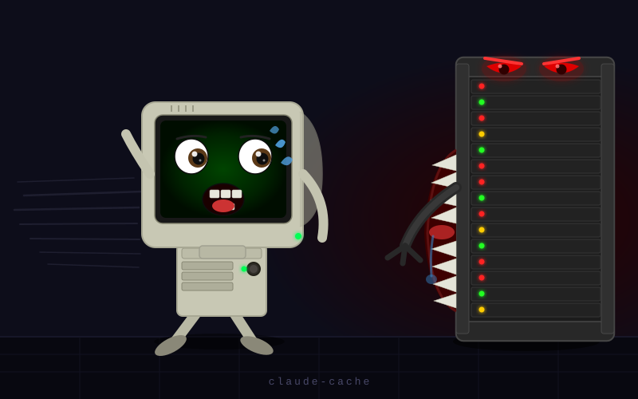

# claude-cache

A Rust caching and routing proxy for the Anthropic API. Drop it in front of any Anthropic client — `ANTHROPIC_BASE_URL=http://localhost:3000` — and it transparently serves repeated or semantically similar prompts from cache, routes low-complexity requests to a local Ollama model, and only calls the real Anthropic API when it must. Over time it learns from every API response and progressively routes more traffic locally.

<div align="center">
  
  <br/><br/>
  <a href="https://buymeacoffee.com/sormondocom" target="_blank">
    
  </a>
</div>

---

## Contents

- [Explain like I'm 5](#explain-like-im-5)
- [A month with claude-cache: real costs and real gains](#a-month-with-claude-cache-real-costs-and-real-gains)
- [How it works](#how-it-works)
  - [Domain and intent classification](#domain-and-intent-classification)
  - [Cache policy](#cache-policy)
  - [Routing gate scoring](#routing-gate-scoring-details)
  - [Learning layers](#how-the-local-model-learns-from-your-usage)
  - [Giving feedback](#how-to-give-feedback)
- [Quick start](#quick-start)
  - [Prerequisites](#prerequisites)
    - [Rust](#1-rust-stable)
    - [Anthropic credentials](#2-anthropic-credentials)
    - [Ollama](#3-ollama)
    - [Ollama models](#4-ollama-models)
    - [Ghost Chat](#5-ghost-chat)
  - [Build and run](#build-and-run)
  - [Example configuration files](#example-configuration-files)
- [CLI](#cli)
- [Environment variables](#environment-variables)
- [Prompt annotations](#prompt-annotations)
- [Response headers](#response-headers)
- [Endpoints](#endpoints)
  - [Public endpoints](#public-endpoints)
  - [Federation endpoints](#federation-endpoints)
  - [Protected endpoints](#protected-endpoints)
- [Configuration reference](#configuration-reference)
- [Brain mapping](#brain-mapping)
- [Federation](#federation)
- [Practical multi-node deployment](#practical-multi-node-deployment)
- [Smart bypass mode](#smart-bypass-mode)
- [Tuning](#tuning)
  - [Miss reasons](#understanding-miss-reasons)
  - [Multi-turn conversation caching](#multi-turn-conversation-caching)
  - [Getting more cache hits](#getting-more-cache-hits)
  - [Getting more local routing hits](#getting-more-local-routing-hits)
  - [Size limits](#size-limits-and-what-they-mean-for-performance)
- [Getting the most out of training](#getting-the-most-out-of-training)
- [Error reference](#error-reference)
  - [HTTP error codes](#http-error-codes)
  - [Log event codes](#log-event-codes)
  - [Miss-reason header values](#x-cc-miss-reason-values)
- [Database architecture](#database-architecture)

---

## Explain Like I'm 5

You don't need to know anything about AI or software to understand what claude-cache does. Here's the honest, jargon-free version.

---

### What is Claude, and why does it cost money?

Claude is an AI assistant made by a company called Anthropic. Every time you ask it a question — whether through an app, a coding tool, or anything else built on top of it — your question gets sent over the internet to Anthropic's computers, which think about it and send back an answer. Anthropic charges a small fee each time this happens, based on how long the question and answer are.

For a single question that cost is tiny. But if you're a developer using Claude as part of your work, you might send it hundreds or thousands of questions a day — and the costs add up. More importantly, every trip to Anthropic's computers takes time: typically one to ten seconds for a response. That adds up too.

---

### What is Claude actually doing when it answers you?

Before we go any further, there's one honest thing worth understanding about how Claude — and every AI assistant like it — actually works.

Claude is not a search engine. It is not looking anything up in a database of facts when you ask it a question. What Claude does is **predict**. It was trained on an enormous amount of human-written text — books, websites, code, conversations — and through that training it became very good at predicting what a knowledgeable, helpful response would look like. When you ask "how do I reverse a list in Python?", Claude is not checking a Python manual. It is producing the response that its training suggests a knowledgeable programmer would write.

That prediction is usually right. For well-established topics — common programming patterns, widely documented concepts, everyday general knowledge — the predictions are excellent. But they are still predictions.

**What this means in plain English:**

- **Claude can be confidently wrong.** An AI assistant doesn't always know when it's uncertain. It can produce an answer that sounds detailed and well-reasoned, and still be incorrect. This is often called *hallucination* — not a lie, not a bug, just what happens when a very sophisticated guessing machine makes a plausible-sounding guess that happens to be false.
- **The more obscure or recent the topic, the more careful you should be.** Things that appeared a lot in training data get good predictions. Things that appeared rarely, or events after the training cutoff, get riskier ones.
- **Claude is a very capable assistant, not an infallible oracle.** It is extremely useful as a starting point, a collaborator, and a time-saver. It is not a substitute for your own judgment on things that matter.

**Why does this matter for claude-cache?**

claude-cache learns from Claude's responses — when the local model gives a different answer and Claude gives another, the gap between them becomes a teaching signal. That's useful, but only as reliable as Claude's answers themselves. The feedback loop (`![good]` / `![bad]`) is how you close that gap: when you tell the system an answer was wrong, you're telling it to treat that type of question with more skepticism and route it to the real Claude more often. The notebook is only as good as what goes into it — and your corrections make it better over time.

---

### What does claude-cache actually do?

Think of it like a very smart notebook that sits between you and Claude.

The first time you ask a question, claude-cache passes it through to Claude as normal. But before sending the answer back to you, it writes the question and the answer down in its notebook.

The next time you — or anyone else using the same proxy — asks the same question (or a very similar one), claude-cache looks it up in the notebook and hands back the answer instantly, without bothering Claude at all. No internet trip. No cost. Just the answer, in milliseconds.

---

### What counts as "the same question"?

Two things:

**Exact match** — You asked the exact same question before. Maybe you asked "what are the rules of Rust's borrow checker?" last Tuesday, and you're asking it again today. claude-cache finds the exact match and returns the answer in under a millisecond.

**Close enough** — You're asking something that means essentially the same thing in different words. "How does Rust's borrow checker work?" and "Can you explain Rust borrow checking?" are not identical sentences, but they're asking for the same knowledge. claude-cache uses an AI math technique to compare the *meaning* of questions, not just their exact words, and if they're similar enough it gives you the stored answer.

This is why it works well in practice — real people rarely ask the exact same question twice, but they very often ask questions that are fundamentally about the same topic.

---

### What about questions it hasn't seen before?

For brand-new questions — things no one has asked before — claude-cache has a second trick: a **local AI model** running on your own computer. Think of it as a smaller, faster, free version of Claude that you own outright.

Before spending money to ask Anthropic, claude-cache tries the local model first. If the local model is confident in its answer, you get that answer instantly, for free, without any internet trip. If the local model isn't sure, claude-cache falls back to the real Claude, gets its answer, and adds it to the notebook for next time.

Over time, as the notebook fills up and the local model sees more examples of good answers, it gets better and better at handling questions confidently on its own. What started as a cache becomes something closer to a personal expert — one that has absorbed the accumulated knowledge from every question you've ever asked Claude.

---

### Does it get smarter on its own?

Yes, and you don't have to do anything to make it happen.

Every hour or so, claude-cache reads through the notebook and writes a short summary for each topic — a compact "cheat sheet" that the local model can reference when answering new questions in that area. If the local model gave a wrong answer before and Claude corrected it, that correction gets folded into the next cheat sheet. The system studies its own mistakes.

It also tracks which topics the local model handles well and which ones it struggles with, and automatically adjusts how aggressively it tries to answer things locally vs. deferring to Claude. A topic where the local model is reliably good gets routed locally more often. A topic where it keeps getting things wrong gets sent to the real Claude more often — while simultaneously generating more material for the local model to learn from.

You just use Claude normally. The system handles all of this in the background.

---

### What does this mean for me in practice?

- **Speed:** Repeated or similar questions come back in milliseconds instead of seconds.
- **Cost:** Once a question is in the notebook, answering it again costs nothing. In a typical developer workflow, 60–80% of questions eventually get served from the notebook or the local model.
- **Privacy:** Questions that match the notebook never leave your machine at all — there's no second trip to Anthropic.
- **No behavior change:** You don't change how you use Claude or any of your tools. Just point your existing setup at `http://localhost:3000` instead of Anthropic's servers. Everything else works exactly as before.

---

### Can I tell when it's using the notebook vs. the real Claude?

Yes. Every response comes back with a small label in the HTTP headers (the invisible technical envelope that wraps every web response) that tells you exactly how it was served:

- `exact_cache` — answered from the notebook, exact match
- `semantic_cache` — answered from the notebook, close enough match
- `local` — answered by the local model on your machine
- `api` — answered by the real Claude (and now in the notebook for next time)

If you're a developer, these headers give you full visibility into what's happening. If you're not, you can ignore them entirely — the answers are the same either way.

---

## A month with claude-cache: real costs and real gains

This section uses concrete numbers. Prices are based on current Anthropic API rates (June 2026): **claude-sonnet-4-6** at $3.00 / $15.00 per million input / output tokens. Verify current rates at [Anthropic's pricing page](https://docs.anthropic.com/en/docs/about-claude/pricing) and update the proxy via `POST /api/pricing` if they have changed.

The local Ollama model costs nothing per call — it runs on your own hardware.

---

### Your baseline: what you're spending without claude-cache

The cost of using Claude depends almost entirely on how much text you send and receive. Here are three realistic developer profiles:

| Profile | Calls / day | Avg input tokens | Avg output tokens | Daily cost | Monthly cost |
|---------|------------|-----------------|------------------|-----------|--------------|
| **Light** — occasional Claude Code use, short sessions | 60 | 3,000 | 600 | $1.08 | **~$24** |
| **Moderate** — daily driver, mixed coding + explanation | 150 | 5,000 | 1,000 | $2.25 + $2.25 = $4.50 | **~$99** |
| **Heavy** — all-day sessions, large file context, long outputs | 400 | 7,000 | 1,500 | $8.40 + $9.00 = $17.40 | **~$383** |

*Monthly figures assume 22 working days. Input and output costs are additive — output tokens are 5× more expensive per token than input, so longer responses compound quickly.*

---

### How savings build over your first month

claude-cache doesn't save you much on day one. The notebook is empty, the local model has no context, and everything goes to the API. What changes is what the system learns during that first month — and the savings curve is not linear. It accelerates.

Below is a realistic week-by-week trajectory for a **moderate user** ($99/month baseline):

| Week | What's happening | Cache hit rate | Local model rate | API reduction | Weekly spend |
|------|-----------------|---------------|-----------------|---------------|-------------|
| 1 | Cold start. Cache filling. Exact hits on repeated prompts only. | ~5% | ~3% | ~8% | ~$22 |
| 2 | Semantic hits firing. First domains have 10+ entries; L2 distillation starts. Local model begins handling familiar shapes. | ~18% | ~12% | ~30% | ~$16 |
| 3 | L2 knowledge docs mature for top 2–3 domains. L3 thresholds adapting. Calibration biases computed. Draft-verify enriching API calls. | ~28% | ~18% | ~46% | ~$12 |
| 4 | Steady state approaching. Well-exercised domains serve 60–70% of traffic locally. Forgetting curves extending TTL on high-hit entries. | ~35% | ~22% | ~57% | ~$10 |

**Month 1 total: ~$60** vs. $99 baseline. Savings: **~$39 (~39%).**

The proxy gets more valuable the longer it runs. By month 3, a moderate user typically sees 60–65% reduction. By month 6, 65–75% for well-worn domains.

---

### Projected savings over 12 months

Using the moderate-user baseline ($99/month) with a conservative ramp:

| Month | API reduction | Monthly cost | Cumulative savings vs. baseline |
|-------|-------------|-------------|--------------------------------|
| 1 | 39% | $60 | $39 |
| 2 | 52% | $48 | $90 |
| 3 | 62% | $38 | $151 |
| 4–6 | 65% avg | $35 avg | $256 |
| 7–12 | 68% avg | $32 avg | $447 |

**Year 1 total with cache: ~$440 vs. $1,188 without. Savings: ~$748 (63%).**

For a **heavy user** ($383/month baseline), the same ramp yields:

| Period | Estimated savings |
|--------|-----------------|
| Month 1 | ~$150 |
| Month 3 onward | ~$240/month |
| Year 1 total | **~$2,700–3,000** |

These figures assume you keep using Claude across the same topics. If your work is highly varied and every prompt is genuinely novel, the savings are lower. If your work is repetitive — documentation, code review, boilerplate generation, the same patterns day after day — savings are higher.

---

### The speed dividend

Cost is only half the picture. Every cache hit also eliminates a network round-trip.

| Source | Typical response time |
|--------|----------------------|
| Anthropic API (claude-sonnet-4-6) | 2–10 seconds |
| Local Ollama model (gemma4) | 1–4 seconds |
| Semantic or exact cache hit | < 10 milliseconds |

A moderate user with 57% API reduction by week 4 has roughly 86 cached/local responses per day. At an average of 4 seconds saved per non-API response:

- **~5.7 minutes saved per working day**
- **~2.1 hours saved per working month**
- **~25 hours saved in the first year** — just in waiting

For developers in a flow state, eliminating a 4-second pause 86 times a day is a qualitative change, not just a time math exercise.

---

### What you actually have at the end of month one

Beyond the cost and speed numbers, a month of usage leaves you with a system that has genuinely learned your work:

**A personal knowledge base.** Your cache holds hundreds or thousands of the actual questions you asked and the answers Claude gave. These are indexed semantically, so asking "how does X work" retrieves prior knowledge about X even if you phrased it differently before.

**Domain cheat sheets your local model reads.** The L2 distillation system has synthesized your most-used topics into compact reference documents. The local model reads the relevant one before answering any new question in that area — it knows your conventions, your stack, your patterns.

**A calibrated routing system.** L3 has measured which domains the local model handles confidently and which ones it struggles with, and has adjusted the routing gate accordingly. The proxy is no longer guessing — it has 30 days of evidence about when to trust the local model.

**Mistakes already corrected.** Every time the local model was wrong and Claude corrected it, that pair was stored and fed into the next distillation run. The cheat sheets are not just "what is correct" — they include "here is what the local model gets wrong, and here is why."

**A cache that extends itself.** Forgetting curves are already in effect — entries you access often have had their TTL extended, so they stay available even as the cache fills with newer material.

---

### Choosing the right local model

The local model is the biggest lever on quality vs. cost savings. Smaller models are faster and cheaper to run but escalate to the API more often (lower confidence scores mean more `low_confidence` misses). Larger models answer more correctly but use more RAM and are slower.

| Model | RAM required | Speed | Local answer rate | Best for |
|-------|-------------|-------|------------------|---------|
| `gemma4` (default) | ~6 GB | Fast | Moderate | Balanced default |
| `mistral` | ~5 GB | Fast | Moderate | Short factual Q&A |
| `qwen2.5-coder:14b` | ~10 GB | Medium | High for code | Code-heavy workflows |
| `llama3.3:70b` | ~45 GB | Slow | High | Maximum quality, GPU required |

The proxy works with any model Ollama supports. Change `local.model_id` in `config.toml` and run `ollama pull <model>`.

---

### Upgrading to Haiku for the API fallback

If your workflow tolerates slightly lower response quality on novel prompts, you can point the proxy at **claude-haiku-4-5** instead of Sonnet. Haiku costs $1/$5 per MTok (one-third the price of Sonnet):

```toml
[api]
model = "claude-haiku-4-5"
```

The cache and local model serve identical quality regardless of which API model you use for cache-miss fallback — only cache misses go to the API. If 60% of your traffic is already served locally, switching the fallback model from Sonnet to Haiku cuts your remaining 40% API spend by 67%.

**Combined effect for a moderate user at month 3:**
- Baseline (Sonnet, no cache): $99/month
- With cache, Sonnet fallback: ~$38/month
- With cache, Haiku fallback: ~$13/month
- **Total reduction: ~87%**

---

### Is this worth it for a Pro/Max subscriber?

If you pay a flat monthly fee for Claude (Pro or Max subscription), the per-token billing argument doesn't apply directly. But the speed and privacy arguments still do — and there is a subtler benefit: **rate limit headroom**.

Pro and Max subscriptions have usage caps on how much you can send in a given window. Every request served from cache or the local model does not count against that cap. Heavy Claude Code users who hit rate limits regularly often find that the proxy effectively doubles or triples their usable quota within the same subscription.

Set `budget.enabled = false` in `config.toml` when running on a subscription plan. The caching and local routing still operate; the spend gate is simply not enforced.

---

## How it works

Every `POST /v1/messages` request passes through an 8-step routing pipeline:

```text
1. Tool-use fast-path      → tools require live semantics; always go to API
2. Domain / intent / complexity classification
3. Policy check            → enforce budget gate; may force API
4. Exact cache lookup      → SHA-256 of (system prompt + normalized prompt)
5. Federation exact        → ask trusted peers for the same hash
6. Embedding computation   → 768-dim nomic-embed-text (once per request)
7a. Semantic cache         → cosine similarity ≥ threshold, same domain
7b. Federation semantic    → same search across trusted peers
8. Routing gate            → 3-axis score: novelty, complexity, consequence
   ├─ pass  → local Ollama model (gemma4 or your choice)
   └─ fail  → Draft-verify: if a near-miss exists (sim ≥ 0.65 < threshold),
              prepend that cached response as a speculative draft for the API
              → Anthropic API (response cached; miss_reason = draft_verify)
```

---

### Domain and intent classification

Every prompt is classified along two axes before the cache lookup and routing gate run. Classification uses weighted keyword matching — no separate model call is required.

**Supported domains (15 + general):**

| Domain | What it covers |
|--------|---------------|
| `rust` | Rust language, borrow checker, Cargo, lifetimes |
| `typescript` | TypeScript, type annotations, TSConfig, ts-node |
| `javascript` | JavaScript, Node.js, browser APIs, npm |
| `python` | Python, pip, virtual envs, asyncio |
| `sql` | SQL queries, schema design, migrations, ORMs |
| `shell` | Bash, zsh, PowerShell, POSIX shell scripting |
| `go` | Go language, goroutines, modules, channels |
| `c` | C language, pointers, manual memory management |
| `cpp` | C++, templates, STL, RAII |
| `java` | Java, JVM, Maven, Gradle, Spring |
| `assembly` | x86/ARM assembly, registers, machine code |
| `docker` | Dockerfiles, Compose, image layers, registries |
| `git` | Git commands, history, rebase, blame, conflicts |
| `toml` | TOML configuration files (Cargo.toml, config.toml) |
| `yaml` | YAML files, CI config, Kubernetes manifests |
| `general` | Everything else — no strong domain signal |

**Supported intents (9 + general):**

| Intent | Triggered by |
|--------|-------------|
| `fix` | "fix", "debug", "error", "bug", "broken", "fails" |
| `explain` | "explain", "what is", "how does", "why", "describe" |
| `generate` | "write", "create", "implement", "generate", "build" |
| `review` | "review", "check", "audit", "inspect", "look at" |
| `refactor` | "refactor", "clean up", "reorganize", "restructure" |
| `optimize` | "optimize", "speed up", "performance", "faster" |
| `summarize` | "summarize", "summarise", "tldr", "overview", "brief" |
| `convert` | "convert", "migrate", "translate", "port", "rewrite in" |
| `test` | "test", "spec", "assert", "coverage", "unit test" |
| `general` | No strong intent signal detected |

Domain and intent together form the routing key. Each `(domain, intent)` pair gets its own L3 adaptive threshold, calibration bias, and contrast pair store. The `x-cc-domain` and `x-cc-intent` response headers show the classification for every request.

---

### Cache policy

Before the cache lookup, a policy layer applies rules that may modify or skip caching for certain prompts.

**Recency bypass**

Prompts asking about something recent or actively-changing bypass the cache entirely and go straight to the API, regardless of whether a cached answer exists. The bypass fires when the prompt contains any of: `new`, `latest`, `recent`, `updated`, `released`, `just`, `current`, `today`, or a bare year (`2024`, `2025`, `2026`) — without a specific version number alongside it.

The rationale: "what changed in Rust 1.78?" is a stable factual question (version number present — cache it with a halved TTL). "What's new in Rust?" asks about the present moment and must never be served from a cached answer made six months ago. The `x-cc-miss-reason: policy_bypass` header appears when this fires.

**Version-aware TTL halving**

When a prompt contains a version specifier (e.g. `1.78`, `v3`, `2024-07`) but no bare recency trigger, the entry is cached at half the normal TTL (minimum 30 minutes). This keeps version-specific answers available without locking in an outdated response as the ecosystem moves forward.

**Shareability filter**

Cache entries are not shared with federation peers when the prompt contains any of: `my api key`, `my secret`, `my password`, `my token`, `confidential`, `proprietary`, `internal`, `our codebase`, `our company`, `private key`. These entries are stored locally and served from local cache normally, but they are excluded from the hash advertisements sent during peer announces and from federation lookup responses — they never leave the node they were created on.

---

### Routing gate scoring details

The routing gate computes three scores independently. **All three** must be below their configured thresholds for the request to go to the local model. Any single axis above threshold causes escalation to the Anthropic API.

**Novelty**

Novelty measures how unfamiliar the prompt is relative to the cache. The base score comes from the hit count of the closest semantic match:

| Hit count | Base novelty |
|-----------|-------------|
| 0 (cold) | 0.80 |
| 1 | 0.50 |
| 2–4 | 0.35 |
| 5–19 | 0.20 |
| 20+ | 0.05 |

Semantic similarity then reduces novelty: `final_novelty = base − (similarity × 0.70)`. A prompt at 0.95 similarity to a heavily-hit cache entry arrives at the gate with a very low novelty score.

Two situations increase novelty further:
- **Code block bump** — if the prompt contains a ` ``` ` code block and the cache hit count is 0, novelty increases by `+0.10`. Unfamiliar code in a cold prompt is treated with extra caution.
- **L3 adaptation** — per `(domain, intent)` threshold overrides shift based on observed escalation rates (see [Layer 3](#layer-3--adaptive-routing-thresholds)).

**Complexity**

Complexity is seeded from the domain (`assembly` = 0.70, `rust` = 0.50, `python` = 0.35) and intent (`review` = 0.35, `generate` = 0.25, `explain` = 0.15), then adjusted:
- `+0.06` per complexity-booster keyword in the prompt (e.g. "thread-safe", "async", "concurrent", "recursive")
- `−0.06` per simplicity-reducer keyword (e.g. "simple", "basic", "quick")
- `+0.05` for prompts longer than 100 words; `+0.10` for prompts longer than 200 words

**Consequence**

Consequence reflects the stakes of getting the answer wrong. Base values:

| Intent | Consequence |
|--------|-------------|
| `review` | 0.70 |
| `fix` | 0.45 |
| `test` | 0.30 |
| `convert` / `explain` | 0.20 |

| Domain | Consequence |
|--------|-------------|
| `assembly` / `c` / `cpp` | 0.60 |
| `rust` / `python` / `typescript` | 0.40 |
| `shell` / `javascript` | 0.35 |
| `sql` | 0.25 |
| `toml` / `yaml` | 0.20 |

The higher of the intent and domain consequence scores is taken. **Safety bump:** if the intent is `review` and complexity exceeds 0.50, consequence receives an additional `+0.20`, forcing a complex code-review request to the API even when the base consequence score alone would have cleared the threshold.

The `x-cc-novelty`, `x-cc-complexity`, and `x-cc-consequence` response headers expose all three scores. `x-cc-miss-reason` tells you which axis (if any) triggered an escalation.

---

### How the local model learns from your usage

claude-cache never requires manual training. Every API response it fetches, every local attempt it makes, and every follow-up message you send is turned into a training signal. The six learning layers below activate progressively as the cache fills — there is nothing to configure to start them, and they never stop running.

**Layer 1 — Few-shot context injection** (active from the first few dozen cache entries)

Before each local Ollama call, the router looks up the top-K cache entries in the same domain whose semantic similarity to the current prompt falls in the range `[learning.min_sim, embedding.sim_threshold)`. That lower bound keeps the window below the cache-hit threshold so the proxy never injects a cached answer as context for itself. The matching Q&A pairs are prepended as prior conversation turns so the local model sees: "here is how a similar question was answered correctly — now answer this new but related question." The effect is immediate and requires no distillation pass.

**Layer 2 — Background knowledge distillation** (fires hourly once a domain has ≥10 cache entries)

The `Distiller` background task scans all domains, picks those with enough accumulated entries, pulls the top 20 by hit count, and asks Ollama itself to synthesize them into a compact domain reference document (~700 words). That document is stored in `domain_knowledge` and prepended as a system-prompt prefix on every subsequent local call for that domain. Each run version-increments the document and incorporates newer entries, so the knowledge base compounds over time. If L5 contrast pairs exist, the distillation prompt includes a "study these to understand what to AVOID" section, so the document covers failure modes alongside correct patterns. You can force a distillation run immediately via `POST /api/learning/distill/:domain`.

**Layer 3 — Adaptive routing thresholds** (runs every 15 minutes)

The `ThresholdAdaptor` computes an escalation rate per `(domain, intent)` pair over the past 24 hours. If a domain's escalation rate exceeds 70% (the local model is failing frequently), the novelty threshold for that shape is raised by `adapt_step` (0.05) — more prompts reach the local model, generating more contrast pairs to drive L2 improvement. If the rate falls below 25% (the local model is handling the shape confidently), the threshold is lowered, making the gate more selective again. Overrides are persisted to `routing_thresholds` and loaded into an in-memory `ArcSwap<ThresholdMap>` on startup so calibration survives a restart. L4 quality feedback (below) blends into this calculation directly.

**Layer 4 — Quality feedback** (explicit and implicit)

When you add `![good]` or `![bad]` to a message, the annotation is stripped before the request is forwarded and a signal is recorded in `response_feedback`. Each `![bad]` counts as `adapt_feedback_weight` (default 2.0) implicit escalations against that domain/intent pair; each `![good]` offsets the same weight. This shifts the L3 escalation rate calculation even for domain/intent pairs that haven't accumulated enough routing samples for the main adaptation pass — a feedback-only pass handles those. See [How to give feedback](#how-to-give-feedback) for the correct usage pattern.

claude-cache also detects **implicit feedback** from your natural writing. If your follow-up contains strong contradiction language ("that's wrong", "no", "incorrect", "not quite") a `bad` signal is recorded against the prior prompt's domain. Affirmation language ("exactly", "perfect", "thank you", "great") records a `good` signal. These fire automatically on every multi-turn conversation without any annotation, requiring zero extra effort from you. Explicit `![good]`/`![bad]` annotations override implicit detection — the system never double-counts both signals for the same message.

**Layer 5 — Contrastive failure learning** (ongoing)

Whenever the local model answers with confidence below `local.confidence_floor` (default 0.75), the proxy stores both the local attempt and the correct API response as a contrast pair in `escalation_pairs`. Those pairs feed into the next L2 distillation run. If `contrast_in_fewshot = true`, one pair is also injected directly into the L1 few-shot block as a labeled wrong/correct example so the model sees recent failure patterns at inference time.

**Layer 6 — Confidence calibration** (fires hourly by default)

The local model's self-reported confidence scores are rarely well-calibrated — a model that claims 0.90 confidence is not necessarily right 90% of the time. The `CalibrationRunner` background worker periodically tests this: it samples a batch of API-sourced cache entries, re-runs them through the local model, and computes word-overlap similarity between the local answer and the known-correct API answer (word Jaccard similarity as a proxy for factual accuracy). The difference `actual_sim − claimed_conf` is the **calibration bias**. A negative bias means the model overclaims confidence; positive means underconfidence.

Per-(domain, intent) biases are stored in `calibration_log` and loaded into an in-memory `ArcSwap<CalibrationMap>` that the router reads on every request. Before the confidence floor gate, the router applies the bias: `adjusted_conf = claimed_conf + bias`. This means a domain/intent pair where the model systematically overclaims gets its confidence score corrected downward, escalating to the API at the right rate rather than allowing overconfident local responses. Biases are recomputed every `calibration_interval_secs` (default 1 hour) using a rolling `calibration_window_secs` (default 7 days) of samples.

**Forgetting curves for cache TTL**

By default, cache entries have a fixed TTL set by `cache.default_ttl_secs` (30 days). The `ForgettingCurveWorker` runs every `forgetting_interval_secs` (default 6 hours) and dynamically adjusts each entry's expiry based on how often it has been accessed, using an Ebbinghaus-style memory model:

```text
strength   = 1 + ln(1 + hit_count)          # grows logarithmically
new_expiry = last_hit_at + base_ttl × min(strength, forgetting_max_multiplier)
```

An entry hit frequently approaches the maximum TTL multiplier (default 8×, so a 30-day entry can live up to 8 months if consistently accessed). An entry that goes unaccessed has a stale `last_hit_at`, so its new expiry falls earlier than the fixed TTL would allow. Cache entries that stop being useful expire sooner; entries that stay relevant live longer — without any manual curation.

---

### How to give feedback

The `![good]` and `![bad]` annotations are **retrospective** — they go on your *next* message after you see a response you want to rate, not on the message that triggered it. You cannot know the quality of a response before you see it, so the design is: receive the response, judge it, then include the annotation on whatever you send next.

The annotation is checked only in the last user message and stripped before routing, so the rest of your message is processed normally.

**Typical patterns:**

```text
# You asked something, got a poor local-model answer.
# Your follow-up rates it and asks a better question in one shot:
![bad] That missed the point — explain Rust lifetime elision rules specifically.

# You got a good answer and want to reinforce it before moving on:
![good] What about the case where the function has multiple reference parameters?

# You just want to signal quality with no follow-up content:
![good]
![bad]
```

The annotation does not need to appear at the start of the message — it can appear anywhere — but leading it is conventional. The domain/intent of the follow-up message is what the signal is recorded against, so keep your follow-up in the same topic area as the response you are rating for the signal to land on the right shape.

A few dozen signals per domain within a 24-hour window is enough to move the L3 threshold by a measurable amount.

---

### Learning layer summary

| Layer | Activates | What it does |
|-------|-----------|-------------|
| **L1 few-shot** | First few dozen entries | Injects top-K semantically similar prior Q&A pairs as conversation context before each local call |
| **L2 distillation** | ≥10 entries per domain, then hourly | Synthesizes cache entries + contrast pairs into a compact domain reference document prepended as system context |
| **L3 adaptive thresholds** | Every 15 min, ≥20 samples | Raises/lowers the routing gate novelty threshold per domain/intent based on escalation rate and L4 feedback |
| **L4 quality feedback** | On any explicit or implicit signal | Shifts L3 escalation rate immediately; `![good]`/`![bad]` annotations and detected contradiction/affirmation both feed this layer |
| **L5 contrast pairs** | Each time local confidence < floor | Records failed local attempts alongside correct API answers; fed into L2 distillation as negative examples |
| **L6 calibration** | Hourly (configurable) | Measures local model accuracy vs. claimed confidence per domain/intent; applies a bias correction to confidence scores before the floor gate |
| **Forgetting curves** | Every 6 hours | Extends TTL for frequently-accessed entries (up to 8×); allows stale entries to expire earlier based on `last_hit_at` |

---

## Quick start

### Prerequisites

Before starting the proxy, make sure you have everything below. Skipping any of these will cause specific features to silently degrade — the proxy will still start, but you'll lose functionality without obvious error messages.

---

#### 1. Rust (stable)

Install via [rustup](https://rustup.rs):

```sh
curl --proto '=https' --tlsv1.2 -sSf https://sh.rustup.rs | sh
```

Rust stable is all that is required. No nightly features are used.

---

#### 2. Anthropic credentials

How you credential the proxy depends on your Anthropic subscription:

**API key (pay-per-token or Max with API access)**

```sh
export ANTHROPIC_API_KEY=sk-ant-...
```

When `ANTHROPIC_API_KEY` is set, the proxy calls `api.anthropic.com` directly. Set `[api] backend = "anthropic"` in `config.toml` (or leave it as `"claude_code"` — the env var takes precedence and the backend auto-selects to `anthropic`).

**Claude Pro or Max subscription (no API key)**

No environment variable needed. The proxy auto-detects the absence of `ANTHROPIC_API_KEY` and switches to the `claude_code` backend, which drives the local `claude` CLI subprocess instead of calling the REST API. This requires:

1. Claude Code installed and authenticated (`claude --version` succeeds)
2. `[api] backend = "claude_code"` in `config.toml` (or rely on auto-detection)

The `~/.claude/.credentials.json` OAuth file written by Claude Code is used automatically — the proxy reads and auto-refreshes it for any passthrough requests that still need HTTP credentials (non-`/v1/messages` endpoints). **Never put credentials in `config.toml`.**

If neither an API key nor a working `claude` CLI is present, requests that miss the cache will fail. Cache hits and local model responses still work.

---

#### 3. Ollama

Ollama runs the local model (for the routing gate and Ghost Chat fallback) and the embedding model (for semantic cache lookups). It must be running before you start claude-cache.

**macOS**

```sh
brew install ollama
ollama serve   # or let the menu-bar app start it automatically
```

**Linux**

```sh
curl -fsSL https://ollama.ai/install.sh | sh
# Registers a systemd service — starts automatically on boot
```

**Windows**

Download the installer from [ollama.ai/download](https://ollama.ai/download). Ollama runs as a tray app and starts at `http://localhost:11434` automatically.

Verify it is running:

```sh
curl http://localhost:11434/api/tags
```

---

#### 4. Ollama models

claude-cache needs two models pulled before it can use them. Neither is large by modern standards; both can run on a laptop.

```sh
# Embedding model — enables semantic cache and Ghost Chat context features
ollama pull nomic-embed-text

# Local answering model — handles low-complexity prompts and Ghost Chat fallback
ollama pull gemma4
```

**What each model does and what breaks without it:**

| Model | Size | Purpose | If missing |
|-------|------|---------|------------|
| `nomic-embed-text` | ~270 MB | Converts prompts to 768-dim vectors for semantic similarity comparisons | Semantic cache disabled. Only exact (SHA-256) cache hits work. L1 few-shot injection and learning layers 2–5 all go dark. Log will show `embedding failed, skipping semantic lookups` on every request. |
| `gemma4` (or your chosen model) | ~6 GB | Answers low-complexity prompts locally without calling Anthropic; also serves as Ghost Chat fallback when Anthropic is rate-limited | All requests escalate to the Anthropic API. Ghost Chat works but cannot fall back locally when the API is unavailable or rate-limited. |

> **Ollama version note:** Ollama ≥ 0.1.34 exposes `/api/embed` (with an `"input"` field); older releases use `/api/embeddings` (with a `"prompt"` field). The proxy auto-detects your version and uses the correct endpoint transparently.

**Choosing a different local model**

The default is `gemma4`. Pick based on available RAM:

| Model | RAM needed | Best for |
|-------|-----------|----------|
| `gemma4` | ~6 GB | Default — good balance of speed and quality |
| `mistral` | ~5 GB | Short factual Q&A |
| `qwen2.5-coder:14b` | ~10 GB | Code-heavy workflows |
| `llama3.3:70b` | ~45 GB | Maximum quality, GPU required |

Change `local.model_id` in `config.toml` to switch. Run `ollama pull <model>` first.

---

#### 5. Ghost Chat

Ghost Chat (`/chat` in the portal) is a browser-based chat interface that routes through the full proxy pipeline. It requires the two Ollama models above to get the most out of it:

- **Without `nomic-embed-text`**: Chat works but responses are never served from semantic cache — every message hits the API or local model cold.
- **Without a local model**: Chat works but there is no fallback when Anthropic rate-limits. You will see errors during heavy usage.
- **With both models**: Chat uses the cache first, falls back to the local model if Anthropic is unavailable, and builds up a semantic cache of your conversations over time.

To access Ghost Chat, open the portal (`http://localhost:3000` by default) and click the **👻 Chat** link. If `CLAUDE_CACHE_PORTAL_TOKEN` is set, you will need to authenticate first.

---

### Build and run

```sh
# Build
cargo build --release

# Run (API key via environment variable — never put it in config.toml)
ANTHROPIC_API_KEY=sk-ant-... ./target/release/claude-cache

# Point any Anthropic client at the proxy
export ANTHROPIC_BASE_URL=http://localhost:3000
```

The proxy reads credentials in this priority order:
1. `ANTHROPIC_API_KEY` environment variable
2. `~/.claude/.credentials.json` (Claude Code / Claude.ai OAuth token — auto-refreshed when it rotates)

---

### Using with Claude Code

```sh
# Add to your shell profile (~/.bashrc, ~/.zshrc, or equivalent)
export ANTHROPIC_BASE_URL=http://localhost:3000
```

Claude Code will automatically use the proxy for all requests. OAuth token rotation from `~/.claude/.credentials.json` is detected within 30 seconds.

---

### Example configuration files

#### Single-node (minimal)

The simplest working setup: one machine, Ollama running locally, no federation, no budget cap. Suitable for personal developer use.

```toml
[server]
host = "127.0.0.1"
port = 3000

[api]
model   = "claude-sonnet-4-6"
# NEVER add api_key here — use ANTHROPIC_API_KEY env var

[local]
enabled          = true
backend          = "ollama"
base_url         = "http://localhost:11434"
model_id         = "gemma4"
confidence_floor = 0.75
timeout_secs     = 120

[embedding]
enabled       = true
base_url      = "http://localhost:11434"
model         = "nomic-embed-text"
sim_threshold = 0.88
dimensions    = 768

[cache]
db_path          = "claude-cache.db"
max_size_mb      = 10240    # 10 GB — adjust to your available disk
default_ttl_secs = 2592000  # 30 days

[routing]
novelty_threshold     = 0.60
complexity_threshold  = 0.40
consequence_threshold = 0.30

[budget]
enabled = false   # disable for API key / subscription billing managed externally

[learning]
enabled               = true
fewshot_k             = 3
min_sim               = 0.65
max_answer_chars      = 1500
distill_enabled       = true
distill_interval_secs = 3600
distill_min_entries   = 10
adapt_enabled         = true
adapt_interval_secs   = 900
contrast_enabled      = true
calibration_enabled   = true

[node]
role = "client"

[federation]
enabled = false

[limits]
messages_per_minute   = 30000
shutdown_timeout_secs = 30

[health]
enabled = false
```

---

#### Distributed — CNC (head node)

The Command & Control node acts as the trust head for a mesh. Run one per team or environment. Replace the example fingerprints with real ones from `claude-cache identity`.

```toml
[server]
host = "0.0.0.0"   # accept connections from other nodes
port = 3000

[api]
model = "claude-sonnet-4-6"

[local]
enabled          = true
backend          = "ollama"
base_url         = "http://localhost:11434"
model_id         = "gemma4"
confidence_floor = 0.75
timeout_secs     = 120

[embedding]
enabled       = true
base_url      = "http://localhost:11434"
model         = "nomic-embed-text"
sim_threshold = 0.88
dimensions    = 768

[cache]
db_path          = "claude-cache.db"
max_size_mb      = 51200    # 50 GB — head node carries more shared entries
default_ttl_secs = 2592000

[routing]
novelty_threshold     = 0.60
complexity_threshold  = 0.40
consequence_threshold = 0.30

[budget]
enabled         = true
db_path         = "claude-cache.budget.db"
daily_limit_usd = 5.00
warn_at_pct     = 80

[learning]
enabled               = true
fewshot_k             = 3
min_sim               = 0.65
max_answer_chars      = 1500
distill_enabled       = true
distill_interval_secs = 3600
distill_min_entries   = 10
adapt_enabled         = true
adapt_interval_secs   = 900
contrast_enabled      = true
calibration_enabled   = true

[node]
role               = "cnc"
auto_promote_peers = false  # keep false; approve peers via POST /v1/trust/:node_id

[federation]
enabled           = true
share_cache       = true
lookup_timeout_ms = 500

[limits]
messages_per_minute   = 30000
shutdown_timeout_secs = 30

[health]
enabled           = true
interval_secs     = 60
timeout_ms        = 2000
failure_threshold = 3
```

---

#### Distributed — client node

Each developer machine runs this config. Swap in the real CNC fingerprint (from `claude-cache identity` on the CNC).

```toml
[server]
host = "127.0.0.1"   # local only; or "0.0.0.0" if other nodes need to reach this one
port = 3000

[api]
model = "claude-sonnet-4-6"

[local]
enabled          = true
backend          = "ollama"
base_url         = "http://localhost:11434"
model_id         = "gemma4"
confidence_floor = 0.75
timeout_secs     = 120

[embedding]
enabled       = true
base_url      = "http://localhost:11434"
model         = "nomic-embed-text"
sim_threshold = 0.88
dimensions    = 768

[cache]
db_path          = "claude-cache.db"
max_size_mb      = 10240
default_ttl_secs = 2592000

[routing]
novelty_threshold     = 0.60
complexity_threshold  = 0.40
consequence_threshold = 0.30

[budget]
enabled = false

[learning]
enabled               = true
fewshot_k             = 3
min_sim               = 0.65
max_answer_chars      = 1500
distill_enabled       = true
distill_interval_secs = 3600
distill_min_entries   = 10
adapt_enabled         = true
adapt_interval_secs   = 900
contrast_enabled      = true
calibration_enabled   = true

[node]
role                  = "client"
cnc_url               = "http://192.168.1.10:3000"   # replace with your CNC address
cnc_node_id           = "a3f1b2c4d5e6f7a8..."        # from `claude-cache identity` on CNC
cnc_announce_delay_secs = 3

[federation]
enabled           = true
share_cache       = true
lookup_timeout_ms = 500

[limits]
messages_per_minute   = 30000
shutdown_timeout_secs = 30

[health]
enabled           = true
interval_secs     = 60
timeout_ms        = 2000
failure_threshold = 3
```

Set `CLAUDE_CACHE_PORTAL_TOKEN` on each node if you want to protect the web dashboard:

```sh
export CLAUDE_CACHE_PORTAL_TOKEN=your-secret-token
./target/release/claude-cache
```

---

## CLI

```text
claude-cache [OPTIONS] [COMMAND]
```

### Options

| Flag | Default | Description |
|------|---------|-------------|
| `--config <PATH>` | `config.toml` | Path to the TOML configuration file |
| `--role <cnc\|client>` | from config | Override node role at startup |
| `--cnc-url <URL>` | from config | Override CNC URL for client bootstrapping |
| `--cnc-node-id <ID>` | from config | Override CNC fingerprint for client bootstrapping |
| `--cache-db <PATH>` | from config (`cache.db_path`) | Override the cache SQLite database path |
| `--budget-db <PATH>` | from config (`budget.db_path`) | Override the budget ledger database path |
| `--trust-db <PATH>` | `claude-cache.trust.db` | Override the trust/federation database path |
| `--key-file <PATH>` | `node_identity.key` | Override the node identity key file path |

All path flags accept absolute or relative paths. Relative paths are resolved from the working directory at startup, not from the config file location. **Database path overrides cannot be hot-reloaded** — they take effect only at startup.

### Subcommands

#### `claude-cache identity`

Print this node's stable Ed25519 fingerprint and public key, then exit. The fingerprint is the value to use as `node_id` when registering this node in another machine's `config.toml` or when calling `POST /v1/trust/:node_id`.

The `--key-file` flag (top-level) controls which key file is read:

```text
claude-cache --key-file /etc/claude-cache/node.key identity
```

Example output:
```text
fingerprint: a3f1b2c4d5e6f7a8b9c0d1e2f3a4b5c6
public_key:  a3f1b2c4d5e6f7a8b9c0d1e2f3a4b5c6d7e8f9a0b1c2d3e4f5a6b7c8d9e0f1a2
```

---

## Environment variables

| Variable | Description |
|----------|-------------|
| `ANTHROPIC_API_KEY` | Proxy's Anthropic API key. Takes priority over `~/.claude/.credentials.json`. |
| `CLAUDE_CACHE_PORTAL_TOKEN` | Bearer token required to access protected management endpoints. If unset, the portal is open to any local caller. **Never store this in config.toml.** |
| `RUST_LOG` | Log filter (e.g. `claude_cache=debug`). Defaults to `claude_cache=info`. |

---

## Prompt annotations

Add these tags anywhere in a prompt to control routing behavior:

| Annotation | Effect |
|------------|--------|
| `![direct]` | Bypass cache and local model entirely; go straight to the Anthropic API |
| `![good]` | Rate the **previous** response as satisfactory — positive quality signal fed into L3/L4 threshold adaptation. Goes on your *next* message after seeing the response. |
| `![bad]` | Rate the **previous** response as unsatisfactory — negative quality signal that raises the escalation score for this domain. Goes on your *next* message after seeing the response. |

Annotations are stripped from the message before it is forwarded; the model never sees them.

See [How to give feedback](#how-to-give-feedback) for the full usage pattern, including how to combine an annotation with a follow-up question in the same message.

Example:
```text
What is the capital of France? ![direct]
```

---

## Response headers

Every response from `POST /v1/messages` includes routing telemetry headers:

| Header | Description |
|--------|-------------|
| `x-router-source` | How the request was served: `exact_cache`, `semantic_cache`, `local`, `api`, `api-stream`, `cache-sse`, `credit-bypass`, `credit-bypass-stream` |
| `x-cc-domain` | Classified domain (e.g. `rust`, `python`, `general`) |
| `x-cc-intent` | Classified intent (e.g. `generate`, `explain`, `review`) |
| `x-cc-novelty` | Novelty score (0–1); gate threshold is `routing.novelty_threshold` |
| `x-cc-complexity` | Complexity score (0–1); gate threshold is 0.40 |
| `x-cc-consequence` | Consequence score (0–1); gate threshold is 0.30 |
| `x-cc-l3-threshold` | Active novelty threshold after L3 adaptation |
| `x-cc-l3-base` | Base config novelty threshold (present when adapted) |
| `x-cc-l3-adapted` | `1` if the threshold was adapted from the base value |
| `x-cc-l2-doc-chars` | Size of the L2 knowledge document injected (if any) |
| `x-cc-l1-shots` | Number of few-shot examples injected (L1) |
| `x-cc-l1-min-sim` | Minimum cosine similarity among injected L1 shots |
| `x-cc-l1-max-sim` | Maximum cosine similarity among injected L1 shots |
| `x-cc-l5-contrast` | `1` if a L5 contrast pair was injected |
| `x-cc-confidence` | Local model confidence score (0–1; present for `local` decisions) |
| `x-cc-miss-reason` | Why cache/local was not used. Values: `routing_gate_novelty`, `routing_gate_complexity`, `routing_gate_consequence`, `low_confidence`, `local_error`, `tool_use`, `user_direct`, `policy_bypass`, `draft_verify` |

---

## Endpoints

### Public endpoints

These endpoints require no authentication.

---

#### `POST /v1/messages`

The main proxy endpoint. Drop-in replacement for `POST https://api.anthropic.com/v1/messages`.

Accepts the same JSON body as the Anthropic Messages API. Supports both synchronous and streaming (`"stream": true`) requests. Cache hits for streaming requests synthesize a proper SSE event stream rather than returning a flat JSON object.

Rate-limited to `limits.messages_per_minute` requests per minute when that value is non-zero. Returns `HTTP 429` with a `Retry-After: 2` header when the limit is exceeded.

---

#### `GET /health`

Liveness check.

**Response:**
```json
{
  "status": "ok",
  "node_id": "a3f1b2c4...",
  "cache_entries": 1234,
  "federation_peers": 2,
  "credits_exhausted": false,
  "manual_bypass": false
}
```

`credits_exhausted: true` means the proxy's Anthropic API balance is depleted and requests are being forwarded directly using client credentials. Call `POST /api/credits/reset` after topping up.

`manual_bypass: true` means an operator has explicitly enabled bypass mode via `POST /api/bypass/enable`. Call `POST /api/bypass/disable` to restore proxy routing.

---

### Federation endpoints

These endpoints use Ed25519 signature-based authentication and are active when `federation.enabled = true`.

---

#### `POST /v1/federation/announce`

Peer announce and bootstrap. A node calls this to register itself with another node and share its list of cache hashes.

The payload must be self-signed with the announcing node's Ed25519 key. Evicted nodes receive `HTTP 403`. Untrusted nodes are registered but their hashes are not fetched. If this node is a CNC and `auto_promote_peers = true`, the announcing node is immediately promoted to Trusted and the response includes a counter-signature.

**Body:** `AnnouncePayload` (self-signed; generated by the client automatically at startup)

**Response (trusted peer):**
```json
{ "ok": true, "status": "trusted", "received": 42 }
```

**Response (CNC, trusted peer):**
```json
{
  "ok": true,
  "status": "trusted",
  "received": 42,
  "counter_signature": "...",
  "counter_node_id": "a3f1b2c4..."
}
```

---

#### `GET /v1/federation/lookup/:hash`

Look up a single cache entry by its SHA-256 hash. Used by the federation client when exact-match lookups miss locally. The response is signed with this node's identity key.

Returns `HTTP 404` if the hash is not found.

---

#### `POST /v1/federation/semantic`

Semantic search across this node's cache. Accepts an embedding vector and returns the top matching entries above the similarity threshold.

**Body:**
```json
{
  "domain": "rust",
  "embedding": [0.1, 0.2, "..."],
  "sim_threshold": 0.88,
  "limit": 5
}
```

Results are capped at 10 entries regardless of `limit`.

---

#### `GET /v1/federation/peers`

Returns this node's identity and high-level federation status.

**Response:**
```json
{
  "node_id": "a3f1b2c4...",
  "public_key": "a3f1b2c4...",
  "is_cnc": false,
  "peer_count": 2,
  "enabled": true,
  "trusted_peers": 2
}
```

---

#### `GET /v1/federation/peers/list`

Returns the list of trusted peers with their URLs and public keys. Used by gossip discovery: a new node calls this on a known peer to bootstrap knowledge of the full mesh.

**Response:** Array of `{ node_id, url, public_key_hex }` objects.

---

#### `GET /v1/federation/revocations`

Pull the full revocation list from this node. Used by peers during startup sync and hourly gossip.

---

#### `GET /v1/federation/knowledge/:domain`

Return this node's learned knowledge for a domain: the L2 knowledge document, per-intent calibration biases, and the most recent contrast pairs. Used by federation peers when distilling a domain — they fetch knowledge from all trusted peers and blend it with their own local data to produce a richer synthesis. Requires the caller to be a trusted peer (standard federation auth).

**Response:**
```json
{
  "domain": "rust",
  "node_id": "a3f1b2c4...",
  "knowledge_doc": "Rust borrow checker rules: ...",
  "calibration_biases": { "generate": -0.08, "explain": 0.02 },
  "contrast_pairs": [
    { "intent": "generate", "wrong": "...", "correct": "..." }
  ]
}
```

---

#### `POST /v1/federation/revocations`

Receive a pushed revocation from a peer. One-hop only — this node does not re-broadcast to prevent gossip storms. Peers can pull the updated list via `GET /v1/federation/revocations`.

---

#### Any other path — passthrough proxy

Any request that does not match a known route is forwarded transparently to the Anthropic API (`api.base_url`). The proxy injects its own credentials and forwards `anthropic-version` and `anthropic-beta` headers. This allows clients to use other Anthropic endpoints (e.g. `/v1/models`, `/v1/count_tokens`) without any special configuration.

---

### Protected endpoints

All endpoints below require an `Authorization: Bearer <token>` header when `CLAUDE_CACHE_PORTAL_TOKEN` is set. If the variable is not set, they are open.

---

#### `GET /`

Web dashboard. Shows cache stats, budget bar, trust/node table with health and latency, routing activity for the last 24 hours, and a searchable cache entry browser with pin/delete actions.

---

#### `GET /graph`

Interactive brain knowledge graph. A D3 force-directed visualization of all domain and intent nodes, colored by escalation rate. Click a domain node to filter the sidebar search. Click any cache entry to open a decision trace panel showing the reconstructed routing path, routing gate scores, L1/L2/L3/L5 learning context, and confidence bar. Supports zoom/pan.

---

#### `GET /chat`

Interactive chat interface built into the portal. Chat with Claude (or the local model) directly from the browser, routed through the full proxy pipeline.

Every message routes through the full pipeline (cache → local model → Anthropic API) in exactly the same way as the API endpoint does. A colored routing badge appears below each response showing how it was served:

| Badge | Meaning |
|-------|---------|
| `EXACT CACHE HIT` | Served from cache, exact match |
| `SEMANTIC CACHE HIT` | Served from cache, semantic match |
| `LOCAL MODEL` | Answered by the local Ollama model |
| `ANTHROPIC API` | Answered by the real Claude |
| `CREDIT BYPASS` | Forwarded directly using client credentials |

Navigate to `http://localhost:3000/chat` to open it.

---

#### `GET /stats`

Raw stats JSON: cache metrics, 7-day budget summary, credit and bypass state.

**Response:**
```json
{
  "node_id": "a3f1b2c4...",
  "cache": { "entries": 1234, "hits": 5678, "shared": 42 },
  "budget": { "status": "ok", "spent_usd": 0.12, "limit_usd": 0.50 },
  "spend_7d": ["..."],
  "credits_exhausted": false,
  "manual_bypass": false
}
```

---

#### `GET /api/overview`

Summary used by the dashboard: node identity, federation state, cache counts, and budget status with current per-token pricing.

---

#### `GET /api/cache`

List the 50 most recent shared cache hashes.

---

#### `GET /api/cache/search`

Search cache entries by prompt text and/or domain.

**Query params:**

| Param | Description |
|-------|-------------|
| `q` | Free-text search against prompt content |
| `domain` | Filter by domain (e.g. `rust`, `python`, `general`) |
| `limit` | Max results (default 50, max 200) |

---

#### `GET /api/spend`

30-day daily spend history.

---

#### `POST /api/pricing`

Update the per-token pricing used by the budget ledger without restarting. Useful when Anthropic changes prices.

**Body:**
```json
{ "input_per_1k": 0.003, "output_per_1k": 0.015 }
```

---

#### `POST /api/config/reload`

Hot-reload `config.toml` from disk. Changes to `cache.db_path` and `budget.db_path` are ignored (restart required). All other fields take effect immediately.

---

#### `POST /api/credits/reset`

Clear the credit-exhaustion flag and restore normal proxy routing. Call this after topping up the Anthropic API balance.

---

#### `POST /api/bypass/enable`

Immediately enable manual bypass mode. All subsequent `POST /v1/messages` requests will be forwarded directly to the Anthropic API using the client's own credentials, bypassing the cache, local model, and budget gate. Useful for debugging proxy behavior or temporarily disabling routing without restarting.

**Response:**
```json
{ "ok": true, "bypass": true, "was_active": false }
```

---

#### `POST /api/bypass/disable`

Disable manual bypass mode and restore normal proxy routing.

**Response:**
```json
{ "ok": true, "bypass": false, "was_active": true }
```

---

#### `GET /api/trust`

List all known nodes and their trust states.

---

#### `GET /api/peers/health`

List peer health records: reachability, consecutive failure count, average latency.

---

#### `GET /api/routing`

Routing log for the last 24 hours: per-decision breakdown with percentages, average latency, and estimated savings, plus the 50 most recent individual routing decisions with miss reasons.

---

#### `GET /api/learning/knowledge`

List all distilled domain knowledge documents (L2). Each document is a synthesis of the most-referenced cache entries for a domain, produced by the local model.

---

#### `GET /api/learning/thresholds`

List adaptive novelty threshold overrides (L3). Shows the current effective threshold for each `(domain, intent)` pair that differs from the config base.

---

#### `GET /api/learning/feedback`

List the 100 most recent `![good]` / `![bad]` quality feedback signals (L4).

---

#### `GET /api/learning/contrasts`

List the 50 most recent L5 contrast pairs — cases where the local model was attempted but escalated, stored alongside the correct API response.

---

#### `GET /api/learning/brain`

Aggregate brain growth snapshot across all domains. Returns escalation rates, entry counts, feedback tallies, knowledge document metadata, contrast pair counts, and adaptive threshold state for each domain/intent pair — the same data that drives the `/graph` visualization.

---

#### `GET /api/learning/calibration`

Per-(domain, intent) calibration bias summary for the last 7 days. Shows the mean `actual_sim − claimed_conf` bias for each shape, average claimed vs. actual confidence, sample count, and whether the bias is statistically significant (≥3 samples). A negative bias means the model overclaims confidence in that shape; positive means underconfidence.

---

#### `GET /api/learning/draft-verify`

Draft-verify hit rate statistics for the last 24 hours. Shows total API calls, how many included a draft-verify context prepend, hit rate percentage, and average latency and token counts for draft-verified requests.

---

#### `GET /api/learning/forgetting`

Distribution of live cache entries across forgetting-curve strength tiers. For each distinct `hit_count` value, shows the computed TTL strength multiplier, how many entries are at that tier, and the average remaining time until expiry. Useful for understanding how much of your cache has been promoted to extended TTLs vs. still at the base TTL.

---

#### `POST /api/learning/distill/:domain`

Manually trigger L2 knowledge distillation for a specific domain (e.g. `rust`, `python`). Runs synchronously and returns a preview of the generated document.

**Response:**
```json
{
  "domain": "rust",
  "chars": 4200,
  "preview": "Rust borrow checker rules: ..."
}
```

---

#### `GET /v1/cache/export`

Download cache entries as a JSON file attachment (`cache-export.json`).

**Query params:**

| Param | Description |
|-------|-------------|
| `domain` | Filter by domain |
| `pinned` | `true` to export only pinned entries |
| `limit` | Max entries (default 1000, max 5000) |

---

#### `POST /v1/cache/seed`

Import or pre-warm cache entries. Useful for bootstrapping a fresh node from a known-good set of Q&A pairs.

**Body:**
```json
{
  "prompt": "How do I implement a linked list in Rust?",
  "response": "...",
  "system": "You are a Rust expert.",
  "model": "claude-sonnet-4-6",
  "domain": "rust",
  "pinned": false
}
```

`system` and `model` are optional. `domain` is optional; if omitted the classifier infers it from the prompt. Seeded entries use the domain TTL from config (`cache.domain_ttl` or `cache.default_ttl_secs` — 30 days in the default `config.toml`) unless `pinned: true`.

---

#### `POST /v1/cache/entries/:id/pin`

Pin or unpin a cache entry. Pinned entries are excluded from TTL expiry and LRU eviction.

**Body:**
```json
{ "pinned": true }
```

If body is omitted, defaults to `{ "pinned": true }`.

---

#### `DELETE /v1/cache/entries/:id`

Delete a cache entry by ID.

---

### Trust / eviction endpoints

These endpoints require the portal token (same as all protected endpoints). They are available on both CNC and client nodes; there is no server-side CNC enforcement.

---

#### `GET /v1/trust`

List all known nodes and their trust states. Also available as `GET /api/trust`.

---

#### `POST /v1/trust/:node_id`

Promote a peer to Trusted status. Optionally promote to Head node.

**Body:**
```json
{ "is_head": false }
```

Body is optional; defaults to `{ "is_head": false }`.

---

#### `POST /v1/evict/:node_id`

Evict a peer. Marks the node as Evicted in the trust store, purges any cache entries sourced from it, signs a revocation record, and immediately pushes the revocation to all trusted peers.

**Body:**
```json
{ "reason": "compromised node" }
```

---

## Configuration reference

All settings live in `config.toml`. Most sections support hot-reload: edit the file and either wait up to 10 seconds for the auto-watcher, or call `POST /api/config/reload`. The exceptions are `cache.db_path`, `budget.db_path`, and `server.*` — those require a restart.

---

### `[server]`

| Field | Type | Default | Description |
|-------|------|---------|-------------|
| `host` | string | `"127.0.0.1"` | IP address to bind. Use `"0.0.0.0"` to accept connections from other machines. |
| `port` | integer | `3000` | TCP port to listen on. |

---

### `[api]`

| Field | Type | Default | Description |
|-------|------|---------|-------------|
| `enabled` | bool | `true` | Whether to call any upstream model for cache misses. Set to `false` for fully offline operation (cache and local model only). |
| `model` | string | `"claude-sonnet-4-6"` | Anthropic model passed to the API when routing decides to escalate. Clients can override this per-request. Only applies when `backend = "anthropic"`. |
| `base_url` | string | `"https://api.anthropic.com"` | Anthropic API base URL. Only applies when `backend = "anthropic"`. |
| `backend` | string | `"claude_code"` | Which upstream backend handles cache misses. `"anthropic"` makes direct HTTPS calls to `api.anthropic.com` and requires `ANTHROPIC_API_KEY`. `"claude_code"` spawns the local `claude --print` CLI subprocess and works with any Pro/Max subscription. **Auto-detected:** if `ANTHROPIC_API_KEY` is not set in the environment, `claude_code` is used regardless of this field. |
| `request_timeout_secs` | integer | `300` | Timeout in seconds for upstream calls — both direct API requests and `claude` CLI subprocesses. Increase for large `max_tokens` values or extended thinking requests. **Requires restart to change.** |
| `max_retries` | integer | `2` | Number of retry attempts when Anthropic returns an `overloaded_error` (HTTP 429 capacity pressure — distinct from a quota rate limit). Set to `0` to skip retries and fall through to the local model immediately. Only applies when `backend = "anthropic"`. |
| `retry_delay_ms` | integer | `500` | Base delay in milliseconds between retries. Doubles on each attempt, capped at 8×: 500 → 1000 → 2000 → 2000 ms. Only applies when `backend = "anthropic"`. |
| `claude_code_max_concurrency` | integer | `4` | Maximum number of concurrent `claude` CLI subprocesses. `0` = unlimited (not recommended — the OS imposes its own less-graceful limits). Only applies when `backend = "claude_code"`. |
| `claude_code_queue_timeout_secs` | integer | `30` | Seconds a request waits for a free process slot before failing with a capacity error. Applies when all `claude_code_max_concurrency` slots are occupied. |

**Never store your API key in `config.toml`.** Use the `ANTHROPIC_API_KEY` environment variable.

> **`overloaded_error` vs rate limit:** Anthropic returns HTTP 429 for two distinct situations. A *rate limit* (`rate_limit_error`) means you've exhausted your request or token quota for the current window — the response includes `x-ratelimit-*` headers and the proxy falls back to the local model immediately. An *overload* (`overloaded_error`) means Anthropic's servers are under capacity pressure — no rate limit headers are present, the condition is usually transient, and `max_retries` with backoff will often recover before the local model is needed. This note applies only to `backend = "anthropic"`.

---

### `[local]`

Controls the local Ollama model used as the first escalation target before the Anthropic API.

| Field | Type | Default | Description |
|-------|------|---------|-------------|
| `enabled` | bool | `true` | Whether the local model path is active. When `false`, requests that miss cache go directly to the API. |
| `backend` | string | `"ollama"` | Backend type. Currently only `"ollama"` is supported. |
| `base_url` | string | `"http://localhost:11434"` | Ollama server URL. |
| `model_id` | string | `"gemma4"` | Ollama model to call. Pull it first with `ollama pull gemma4`. |
| `confidence_floor` | float | `0.75` | Minimum confidence score (0–1) the local model must return. Responses below this floor are escalated to the Anthropic API and stored as L5 contrast pairs. |
| `timeout_secs` | integer | `120` | Per-request timeout for local model calls in seconds. |

---

### `[embedding]`

Controls the embedding model used for semantic cache lookups and federation semantic search.

| Field | Type | Default | Description |
|-------|------|---------|-------------|
| `enabled` | bool | `true` | Enable semantic cache. When `false`, only exact-match (SHA-256) lookups are used and the embedding model is not called. |
| `base_url` | string | `"http://localhost:11434"` | Ollama server URL for the embedding model. |
| `model` | string | `"nomic-embed-text"` | Embedding model. Must produce vectors of `dimensions` length. |
| `sim_threshold` | float | `0.88` | Cosine similarity threshold for a semantic cache hit. Higher = more conservative (fewer false positives). Requests with similarity below this but above `learning.min_sim` still qualify as L1 few-shot candidates. |
| `dimensions` | integer | `768` | Embedding vector dimension. Must match the model. `nomic-embed-text` produces 768-dim vectors. |

---

### `[cache]`

| Field | Type | Default | Description |
|-------|------|---------|-------------|
| `db_path` | string | `"claude-cache.db"` | Path to the SQLite cache database. **Requires restart to change.** |
| `max_size_mb` | integer | `51200` | Maximum total cache size in megabytes (default 50 GB). Least-recently-used entries are evicted when this is exceeded. |
| `default_ttl_secs` | integer | `2592000` | Default time-to-live for cache entries in seconds (default 30 days). Pinned entries are exempt. |
| `forgetting_enabled` | bool | `true` | Enable Ebbinghaus-style TTL extension based on access frequency. Frequently-accessed entries live longer; stale entries expire sooner. |
| `forgetting_interval_secs` | integer | `21600` | How often (seconds) to run the forgetting curve adjustment sweep across all non-pinned, non-expired entries (default 6 hours). |
| `forgetting_max_multiplier` | float | `8.0` | Maximum TTL multiplier. A highly-accessed entry cannot exceed `default_ttl_secs × forgetting_max_multiplier`. With the default 30-day TTL, entries can live up to 8 months. |

#### `[cache.domain_ttl]`

Per-domain TTL overrides in seconds. Any domain not listed falls back to `cache.default_ttl_secs`. All 15 classified domains plus `general` are valid keys.

| Key | Description |
|-----|-------------|
| `rust` | TTL for Rust domain entries |
| `typescript` | TTL for TypeScript entries |
| `javascript` | TTL for JavaScript / Node.js entries |
| `python` | TTL for Python entries |
| `sql` | TTL for SQL domain entries |
| `shell` | TTL for shell/bash entries |
| `go` | TTL for Go language entries |
| `c` | TTL for C language entries |
| `cpp` | TTL for C++ entries |
| `java` | TTL for Java / JVM entries |
| `assembly` | TTL for assembly entries |
| `docker` | TTL for Docker / Compose entries |
| `git` | TTL for Git command entries |
| `toml` | TTL for TOML config entries |
| `yaml` | TTL for YAML config entries |
| `general` | TTL for general/unclassified entries |

---

### `[routing]`

The routing gate scores three axes; **all three** must be below their threshold for the request to be routed to the local model. If any axis exceeds its threshold, the request escalates to the Anthropic API.

| Field | Type | Default | Description |
|-------|------|---------|-------------|
| `novelty_threshold` | float | `0.60` | Maximum novelty score to allow local routing. Novelty is high when the prompt is unlike anything in cache (cold start), and decreases as the cache accumulates similar entries. L3 adaptive learning adjusts this per domain/intent. |
| `complexity_threshold` | float | `0.40` | Maximum complexity score. Derived from domain (assembly=0.70, rust=0.50, python=0.35) and intent. |
| `consequence_threshold` | float | `0.30` | Maximum consequence score. Higher for high-stakes intents (review=0.70, assembly=0.60). |
| `draft_verify_enabled` | bool | `false` | Enable draft-verify. When the routing gate sends a request to the API and a semantic near-miss exists in cache (sim ≥ `draft_verify_min_sim`), the cached response is prepended to the system prompt as a speculative draft. The API receives the draft and can cheaply confirm, correct, or extend it rather than answering from scratch. Disabled by default to avoid extra round-trips on low-tier API keys; enable when on a high-quota plan. |
| `draft_verify_min_sim` | float | `0.65` | Minimum cosine similarity for a cached entry to qualify as a draft candidate. Must be less than `embedding.sim_threshold` (full cache hits are served directly and do not reach this step). Validated at startup. |

---

### `[budget]`

Tracks API spend and enforces a daily dollar cap. Disable this section when running on a Claude Pro/Max subscription where you are not billed per token.

| Field | Type | Default | Description |
|-------|------|---------|-------------|
| `enabled` | bool | `false` | Enable budget tracking and enforcement. When `false`, the spend gate is bypassed entirely. **Hot-reloadable.** |
| `db_path` | string | `"claude-cache.budget.db"` | Path to the SQLite budget ledger. **Requires restart to change.** |
| `daily_limit_usd` | float | `0.50` | Daily spend cap in USD. Requests that would exceed this limit are blocked until midnight UTC resets the counter. |
| `warn_at_pct` | integer | `80` | Budget warning threshold as a percentage of `daily_limit_usd`. The `/api/overview` and `/stats` endpoints return `status: "warning"` when spend exceeds this. |
| `input_per_1k_usd` | float | `0.003` | Cost per 1,000 input tokens in USD. Update via `POST /api/pricing` when Anthropic changes pricing. |
| `output_per_1k_usd` | float | `0.015` | Cost per 1,000 output tokens in USD. |

---

### `[learning]`

The six-layer organic learning system. All fields except `distill_interval_secs` and `adapt_interval_secs` are hot-reloadable.

#### Layer 1 — Few-shot context injection

| Field | Type | Default | Description |
|-------|------|---------|-------------|
| `enabled` | bool | `true` | Master switch for L1. When `false`, the local model receives raw prompts with no prior examples. |
| `fewshot_k` | integer | `3` | Maximum number of similar Q&A pairs to inject per request. |
| `min_sim` | float | `0.65` | Minimum cosine similarity to qualify a cache entry as a few-shot candidate. Must be below `embedding.sim_threshold` (cache hits are not injected as shots — they are served directly). |
| `max_answer_chars` | integer | `1500` | Maximum characters to include from each injected answer. Longer answers are truncated to keep the context window manageable. |

#### Layer 2 — Background distillation

| Field | Type | Default | Description |
|-------|------|---------|-------------|
| `distill_enabled` | bool | `true` | Enable background distillation sweeps. |
| `distill_interval_secs` | integer | `3600` | How often to run the distillation sweep in seconds (default 1 hour). |
| `distill_min_entries` | integer | `10` | Minimum cache entries in a domain before distillation runs. Avoids synthesizing documents from too-sparse data. |
| `distill_source_limit` | integer | `20` | Maximum cache entries to feed into a single distillation call. |
| `distill_warmup_secs` | integer | `120` | Seconds to wait after startup before the first distillation sweep. Allows initial traffic to populate the cache before the first synthesis run. |

#### Layer 3 — Adaptive routing thresholds

| Field | Type | Default | Description |
|-------|------|---------|-------------|
| `adapt_enabled` | bool | `true` | Enable adaptive threshold adjustment. |
| `adapt_interval_secs` | integer | `900` | How often to evaluate and adjust thresholds in seconds (default 15 minutes). |
| `adapt_window_secs` | integer | `86400` | Lookback window for escalation rate calculation in seconds (default 24 hours). |
| `adapt_min_samples` | integer | `20` | Minimum routed samples in the window before adaptation fires. Prevents oscillation from small samples. |
| `adapt_high_water` | float | `0.70` | If the escalation rate is above this, the novelty threshold is raised (more traffic goes local). |
| `adapt_low_water` | float | `0.25` | If the escalation rate is below this, the novelty threshold is lowered (the gate becomes more selective again). |
| `adapt_step` | float | `0.05` | How much to move the threshold per adaptation step. |

#### Layer 4 — Explicit quality feedback

| Field | Type | Default | Description |
|-------|------|---------|-------------|
| `adapt_feedback_weight` | float | `2.0` | How heavily each explicit `![good]` / `![bad]` annotation counts against routing-based escalation. `2.0` means each `![bad]` counts as 2 escalations; each `![good]` offsets 2. Set to `0.0` to ignore annotations and rely on escalation rate alone. |

#### Layer 5 — Contrastive failure learning

| Field | Type | Default | Description |
|-------|------|---------|-------------|
| `contrast_enabled` | bool | `true` | Record a contrast pair whenever the local model is attempted but escalated (confidence below floor). |
| `contrast_in_fewshot` | bool | `false` | Inject one contrast pair per domain into the L1 few-shot context so the model sees a recent failure example. |
| `contrast_source_limit` | integer | `5` | Maximum contrast pairs per domain fed into L2 distillation synthesis. |

#### Layer 6 — Confidence calibration

| Field | Type | Default | Description |
|-------|------|---------|-------------|
| `calibration_enabled` | bool | `true` | Enable the background calibration loop. |
| `calibration_batch_size` | integer | `20` | Number of randomly sampled API cache entries to replay through the local model per calibration run. |
| `calibration_window_secs` | integer | `604800` | Look-back window (seconds) for computing calibration biases from stored `calibration_log` samples (default 7 days). |
| `calibration_interval_secs` | integer | `3600` | Seconds between calibration runs (default 1 hour). Floor of 300 seconds enforced regardless of config value. The first run is delayed by one full interval after startup to avoid competing with traffic on a fresh node. |

---

### `[node]`

| Field | Type | Default | Description |
|-------|------|---------|-------------|
| `role` | string | `"client"` | Node role: `"client"` or `"cnc"`. A CNC (Command & Control) node acts as the trust head for the mesh — it counter-signs announcing clients so they can be automatically promoted by other peers. |
| `auto_promote_peers` | bool | `false` | **CNC only.** Automatically promote every announcing peer to Trusted without manual approval. Keep `false` in production; use `POST /v1/trust/:node_id` for explicit approval. |
| `cnc_url` | string | `""` | **Client only.** URL of the CNC to announce to at startup. |
| `cnc_node_id` | string | `""` | **Client only.** Ed25519 fingerprint of the CNC. Obtain it by running `claude-cache identity` on the CNC machine. |
| `bootstrap_delay_secs` | integer | `5` | Seconds to wait after startup before beginning peer discovery gossip. Allows the listener to bind and become ready before peers try to reach this node. |
| `cnc_announce_delay_secs` | integer | `3` | **Client only.** Seconds to wait after startup before announcing to the CNC. Ensures this node is accepting connections before the CNC attempts a callback. |

---

### `[federation]`

| Field | Type | Default | Description |
|-------|------|---------|-------------|
| `enabled` | bool | `false` | Enable the federation mesh. When `false`, all peer lookup steps in the routing pipeline are skipped. |
| `share_cache` | bool | `false` | Advertise local cache hashes during peer announcements so other nodes can fetch entries. |
| `lookup_timeout_ms` | integer | `500` | Per-peer timeout for federation lookup calls in milliseconds. |

#### `[[federation.peers]]`

Declare statically trusted peers. Each entry requires both `url` and `node_id`. Peers declared here are immediately trusted on startup without needing to announce themselves.

```toml
[[federation.peers]]
url            = "http://192.168.1.10:3000"
node_id        = "a3f1b2c4..."   # from `claude-cache identity` on that machine
public_key_hex = ""              # optional; enables signature verification before first announce
```

---

### `[limits]`

| Field | Type | Default | Description |
|-------|------|---------|-------------|
| `messages_per_minute` | integer | `30000` | Rate limit for `POST /v1/messages`. `0` disables rate limiting. Exceeding the limit returns `HTTP 429`. |
| `shutdown_timeout_secs` | integer | `30` | Graceful shutdown drain window in seconds. On `SIGTERM` or `Ctrl+C`, the server stops accepting new connections but waits this long for in-flight requests to complete before forcing exit. |

---

### `[health]`

Peer health checks are only active when `federation.enabled = true`.

| Field | Type | Default | Description |
|-------|------|---------|-------------|
| `enabled` | bool | `true` | Enable background peer health probing. |
| `interval_secs` | integer | `60` | How often to probe each trusted peer's `/health` endpoint in seconds. |
| `timeout_ms` | integer | `2000` | Per-probe timeout in milliseconds. |
| `failure_threshold` | integer | `3` | Consecutive probe failures before a peer is marked unreachable. Unreachable peers are skipped in federation lookups but not evicted — they recover automatically when probes succeed again. |

---

## Brain mapping

Navigate to `http://localhost:3000/graph` in your browser to open the brain knowledge graph.

The graph renders every domain and intent as a node in a D3 force simulation. Node size represents the number of cache entries. Node color encodes 24-hour escalation rate: green (≤25%) → yellow (25–70%) → red (>70%). A pulsing cyan ring marks domains with an active L2 knowledge document. An orange dot badge indicates stored L5 contrast pairs.

**Interactions:**

- **Hover** over any node to see a tooltip with escalation rate, entry count, feedback scores, and knowledge doc status.
- **Click a domain node** to filter the sidebar search to that domain and dim other nodes.
- **Click an intent node** to filter the sidebar to that domain/intent pair.
- **Search** in the sidebar to find cache entries by prompt text. Results show domain, intent, cache hit count, model, confidence, and age.
- **Click a result card** to open the Decision Trace panel — a step-by-step reconstruction of the routing path for that entry, including routing gate scores with pass/fail bars, active L3 threshold and adaptation state, L1/L2/L5 context that was available, confidence bar, and domain routing stats for the last 24 hours.

---

## Federation

A federation mesh lets multiple claude-cache nodes share their caches, dramatically increasing the effective hit rate across a team or organization.

### Network topology

The mesh uses a CNC (Command & Control) head-node model. One node acts as CNC; all others are clients. Clients bootstrap trust by announcing themselves to the CNC, which counter-signs their identity. The counter-signature can then be presented to other peers for automatic promotion, so new nodes need only know the CNC address to be trusted by the entire mesh.

### Setting up a two-node mesh

**On the CNC machine:**

```toml
# config.toml
[node]
role               = "cnc"
auto_promote_peers = false   # use POST /v1/trust/:node_id for explicit approval

[federation]
enabled = true
```

```sh
claude-cache identity   # note the fingerprint
```

**On the client machine:**

```toml
# config.toml
[node]
role        = "client"
cnc_url     = "http://192.168.1.10:3000"
cnc_node_id = "a3f1b2c4..."   # fingerprint from CNC machine

[federation]
enabled = true
```

The client announces itself to the CNC at startup. On the CNC, approve the client:

```sh
curl -X POST http://localhost:3000/v1/trust/<client-node-id>
```

Once trusted, both nodes exchange hashes and perform federated cache lookups automatically.

### Trust states

| State | Description |
|-------|-------------|
| `Untrusted` | Node has announced but not been explicitly approved. Hashes are registered but not fetched. |
| `Trusted` | Node is approved. Cache lookups include this peer. |
| `Head` | Trusted + can counter-sign other nodes' announce payloads for automatic mesh-wide promotion. |
| `Evicted` | Node has been revoked. Announces are rejected (`HTTP 403`). Cache entries sourced from this node are purged. The revocation is gossiped to all trusted peers. |

### Federated knowledge mesh

Beyond sharing cached responses, federated nodes can share their learned knowledge. When the `Distiller` background task runs for a domain and `federation.enabled = true`, it fetches the L2 knowledge document, calibration biases, and recent contrast pairs from every reachable trusted peer via `GET /v1/federation/knowledge/:domain`. The resulting documents are blended — peer knowledge is appended after the local synthesis with a source attribution header — so the final document benefits from the accumulated experience of all nodes in the mesh, not just the local cache.

This means a fresh node in a federation mesh gains mature domain knowledge within hours instead of days, without needing to have personally seen those requests.

### Peer discovery

Nodes gossip their trusted peer list during announcements and in the hourly background sync. A new node only needs to know one existing mesh member; it will discover the rest automatically within one gossip cycle.

---

## Practical multi-node deployment

This section shows how to plan, configure, and operate a multi-node mesh in a repeatable way. The Federation section above explains the concepts; this section explains the ops.

### Choosing a CNC machine

The CNC (Command & Control) node is the trust anchor for the mesh. Its fingerprint is baked into every client's config, so it must be:

- **Always reachable** during client startup (clients announce at boot and after restart)
- **Network-central** — all client nodes must be able to open an HTTP connection to it
- **Not the only cache node** — the CNC participates in cache sharing like any other client; it just also acts as trust authority

If you only have two machines, either one can be CNC. In a team setting, a CI server, a dedicated homelab machine, or a cloud VM is a natural CNC candidate. The CNC does not need public internet exposure — private LAN addressing works as long as clients can reach it.

---

### Pattern A: Managed mesh (recommended for production)

Nodes announce themselves to the CNC; you approve them explicitly. Best for teams where membership changes infrequently and you want an audit trail.

**Step 1 — Start the CNC and record its fingerprint.**

```toml
# /etc/claude-cache/config.toml  (CNC machine)
[server]
host = "0.0.0.0"
port = 3000

[node]
role               = "cnc"
auto_promote_peers = false   # manual approval

[federation]
enabled     = true
share_cache = true

[api]
model    = "claude-sonnet-4-6"
base_url = "https://api.anthropic.com"
```

```sh
# First run — generates node_identity.key and prints the fingerprint
claude-cache identity
# fingerprint: a3f1b2c4d5e6f7a8b9c0d1e2f3a4b5c6d7e8f9a0b1c2d3e4f5a6b7c8d9e0f1a2
# public_key:  <64-char hex>
```

Copy the fingerprint — every client node needs it in `cnc_node_id`.

**Step 2 — Start the CNC server.**

```sh
ANTHROPIC_API_KEY=sk-ant-... \
CLAUDE_CACHE_PORTAL_TOKEN=your-portal-secret \
  claude-cache --config /etc/claude-cache/config.toml
```

**Step 3 — Configure each client node.**

```toml
# /etc/claude-cache/config.toml  (each client machine)
[server]
host = "0.0.0.0"
port = 3000

[node]
role        = "client"
cnc_url     = "http://192.168.1.10:3000"      # CNC address
cnc_node_id = "a3f1b2c4d5e6f7a8b9c0..."       # fingerprint from Step 1

[federation]
enabled     = true
share_cache = true
```

```sh
ANTHROPIC_API_KEY=sk-ant-... \
CLAUDE_CACHE_PORTAL_TOKEN=your-portal-secret \
  claude-cache --config /etc/claude-cache/config.toml
```

At startup, each client announces itself to the CNC. The CNC registers the node as `Untrusted` and logs the event.

**Step 4 — Approve each client on the CNC.**

```sh
# List pending nodes (Untrusted state)
curl -H "Authorization: Bearer $CLAUDE_CACHE_PORTAL_TOKEN" \
  http://cnc-host:3000/v1/trust | jq '.[] | select(.trust.state == "untrusted")'

# Approve a node
curl -X POST http://cnc-host:3000/v1/trust/<node-fingerprint>

# Promote a node to Head (lets it counter-sign future nodes — see Pattern D)
curl -X POST "http://cnc-host:3000/v1/trust/<node-fingerprint>?head=true"
```

Once approved, the client receives a counter-signature from the CNC in the announce response and stores it in `node_countersig.json`. Subsequent announces to any peer carry this signature, enabling automatic trust promotion across the mesh without another manual step.

---

### Pattern B: Auto-approve (dev / trusted LAN)

Any node that announces itself is immediately trusted. Use this for homelab setups or developer machines on a private network where you trust everyone who can reach the CNC.

```toml
# CNC config only — clients are identical to Pattern A
[node]
role               = "cnc"
auto_promote_peers = true   # no manual approval step
```

With `auto_promote_peers = true`, Steps 3 and 4 collapse into: start clients, they self-register and are immediately active. No `curl /v1/trust` call required.

**When not to use this:** any environment where a compromised machine could reach the CNC's port. Auto-promote means any process that can connect gets trusted.

---

### Pattern C: Static mesh (fully deterministic, no CNC)

Declare all peers explicitly in config. No gossip, no dynamic discovery, no CNC role needed. Every node is immediately trusted on startup because the operator has explicitly pinned the trust relationship in config.

```toml
# Node A config.toml
[node]
role = "client"   # no CNC, no announce

[federation]
enabled     = true
share_cache = true

[[federation.peers]]
url            = "http://192.168.1.11:3000"   # Node B
node_id        = "<node-B-fingerprint>"
public_key_hex = "<node-B-pubkey>"

[[federation.peers]]
url            = "http://192.168.1.12:3000"   # Node C
node_id        = "<node-C-fingerprint>"
public_key_hex = "<node-C-pubkey>"
```

Repeat for each node (listing its peers, not itself). Run `claude-cache identity` on each machine before writing the configs to collect the fingerprints.

Static mesh is the most secure option: there is no announce endpoint to exploit and trust relationships cannot be manipulated at runtime. The tradeoff is that adding a node requires a config change and reload on every existing node.

---

### Pattern D: Head-node chain (large teams / multiple subnets)

For teams with many nodes or multiple network segments, promote one node per region as a **Head**. A Head can counter-sign new nodes' announcements, so any peer that has been countersigned by an approved Head is automatically trusted mesh-wide — without the operator touching the CNC again.

```sh
# On the CNC: promote a regional node as Head
curl -X POST "http://cnc-host:3000/v1/trust/<regional-node-id>?head=true"
```

New nodes in that region only need to know the Head's URL and fingerprint (or the CNC's). Once the Head countersigns them, other nodes see the signature and promote automatically. The trust chain is:

```
CNC (root of trust)
 └── Head-West  (can promote West subnet nodes)
      └── Worker-1, Worker-2, ...
 └── Head-East  (can promote East subnet nodes)
      └── Worker-3, Worker-4, ...
```

The counter-signature is verified cryptographically (Ed25519) — no Head can forge signatures for another Head's keys.

---

### Repeatable deployment with environment variables

All node identity fields can be passed as CLI flags, which makes container and CI deployments reproducible without modifying config files:

```sh
# Flags override the matching config fields
claude-cache \
  --config /etc/claude-cache/config.toml \
  --role client \
  --cnc-url http://cnc-host:3000 \
  --cnc-node-id a3f1b2c4d5e6f7a8...
```

This lets a single base `config.toml` be shared across all client nodes, with only the CNC identity passed as a deploy-time variable. No per-node config files needed.

---

### Docker Compose example

A complete three-node mesh: one CNC and two workers.

```yaml
# docker-compose.yml
services:
  cnc:
    image: claude-cache:latest
    environment:
      ANTHROPIC_API_KEY: ${ANTHROPIC_API_KEY}
      CLAUDE_CACHE_PORTAL_TOKEN: ${PORTAL_TOKEN}
    volumes:
      - cnc-data:/data
    command: >
      claude-cache --config /data/config.toml --role cnc
    configs:
      - source: cnc_config
        target: /data/config.toml
    ports:
      - "3000:3000"

  worker-1:
    image: claude-cache:latest
    environment:
      ANTHROPIC_API_KEY: ${ANTHROPIC_API_KEY}
      CLAUDE_CACHE_PORTAL_TOKEN: ${PORTAL_TOKEN}
    volumes:
      - worker1-data:/data
    command: >
      claude-cache --config /data/config.toml
        --role client
        --cnc-url http://cnc:3000
        --cnc-node-id ${CNC_FINGERPRINT}
    depends_on:
      - cnc

  worker-2:
    image: claude-cache:latest
    environment:
      ANTHROPIC_API_KEY: ${ANTHROPIC_API_KEY}
      CLAUDE_CACHE_PORTAL_TOKEN: ${PORTAL_TOKEN}
    volumes:
      - worker2-data:/data
    command: >
      claude-cache --config /data/config.toml
        --role client
        --cnc-url http://cnc:3000
        --cnc-node-id ${CNC_FINGERPRINT}
    depends_on:
      - cnc

configs:
  cnc_config:
    content: |
      [server]
      host = "0.0.0.0"
      port = 3000

      [node]
      role               = "cnc"
      auto_promote_peers = true

      [federation]
      enabled     = true
      share_cache = true

      [api]
      model    = "claude-sonnet-4-6"
      base_url = "https://api.anthropic.com"

      [cache]
      db_path       = "/data/claude-cache.db"
      max_size_mb   = 2048
      default_ttl_secs = 86400

volumes:
  cnc-data:
  worker1-data:
  worker2-data:
```

**First-time bootstrap:**

```sh
# 1. Start just the CNC to generate its identity
docker compose up cnc -d

# 2. Collect the fingerprint
docker compose exec cnc claude-cache identity
#    fingerprint: a3f1b2c4d5e6f7a8...

# 3. Export it as an env var (add to .env file for persistence)
echo "CNC_FINGERPRINT=a3f1b2c4d5e6f7a8..." >> .env

# 4. Start the workers — they announce and are auto-approved (auto_promote_peers = true)
docker compose up -d
```

For production: remove `auto_promote_peers = true`, run `docker compose up -d`, then manually approve each worker with `curl -X POST http://localhost:3000/v1/trust/<fingerprint>`.

---

### Systemd service (Linux bare-metal)

```ini
# /etc/systemd/system/claude-cache.service
[Unit]
Description=claude-cache proxy
After=network-online.target
Wants=network-online.target

[Service]
Type=simple
User=claude-cache
WorkingDirectory=/var/lib/claude-cache
EnvironmentFile=/etc/claude-cache/env
ExecStart=/usr/local/bin/claude-cache --config /etc/claude-cache/config.toml
Restart=on-failure
RestartSec=5

[Install]
WantedBy=multi-user.target
```

```sh
# /etc/claude-cache/env
ANTHROPIC_API_KEY=sk-ant-...
CLAUDE_CACHE_PORTAL_TOKEN=your-portal-secret
RUST_LOG=claude_cache=info
```

The service restarts automatically on failure. The `WorkingDirectory` is where `node_identity.key`, `node_countersig.json`, and the SQLite databases live — use a persistent volume or directory that survives reboots and service restarts.

---

### Mesh management operations

**Check peer health across the mesh.**

```sh
# On any node — see all trusted peers and their health
curl -H "Authorization: Bearer $PORTAL_TOKEN" \
  http://localhost:3000/api/health | jq '.peers'

# Or from the trust endpoint — includes trust state
curl http://localhost:3000/v1/trust | jq '.[] | {node_id: .node_id, trust: .trust.state, reachable: .is_reachable}'
```

**Add a new node to an existing mesh.**

Configure the new node with any existing mesh member's URL (not necessarily the CNC) in `cnc_url`. On announce, the existing node registers the new node as Untrusted and gossips the membership to peers. Then approve on the CNC:

```sh
curl -X POST http://cnc-host:3000/v1/trust/<new-node-fingerprint>
```

The CNC's counter-signature is returned to the new node, which stores it in `node_countersig.json`. On the next gossip cycle, all peers see the CNC endorsement and auto-promote the new node.

**Remove a node (graceful).**

Stop the process on the target machine. It will be marked unreachable after `health.failure_threshold` consecutive failed health checks (default: 3 failures × 60-second interval = 3 minutes). No data is lost; it can rejoin later without re-approval because its trust record persists.

**Evict a node (permanent).**

```sh
curl -X POST http://cnc-host:3000/v1/evict/<node-fingerprint> \
  -H "Content-Type: application/json" \
  -d '{"reason": "machine decommissioned"}'
```

Eviction:
1. Marks the node `Evicted` in the trust store
2. Purges all cache entries that originated from that node
3. Immediately pushes a signed revocation record to all trusted peers via gossip
4. Peers apply the revocation and purge entries from the evicted node as well

The signed revocation is also returned to any new node that syncs at startup, so a node that was offline during the eviction event still receives it.

**Re-admit an evicted node.**

There is no un-evict API — eviction is permanent. To re-admit the machine, delete `node_identity.key` on it (generating a new identity) and go through the bootstrap process again.

---

### Security checklist

- [ ] Set `CLAUDE_CACHE_PORTAL_TOKEN` on every node — without it, management endpoints are open to any local caller
- [ ] Keep `auto_promote_peers = false` in production — use explicit `POST /v1/trust/:id` approval
- [ ] Run the proxy behind a reverse proxy (nginx/caddy) with TLS if nodes communicate over untrusted networks
- [ ] The `node_identity.key` file holds the private signing key — restrict file permissions (`chmod 600`) or use the Windows icacls protection applied automatically on first write
- [ ] Store `ANTHROPIC_API_KEY` in environment or secrets manager, not in `config.toml`
- [ ] After decommissioning a machine, evict it before reusing the IP — stale trusted entries with a reused IP could route traffic to the wrong machine until health checks catch up

---

## Smart bypass mode

claude-cache has two bypass modes. In both cases `POST /v1/messages` is forwarded directly to the Anthropic API using the **client's own** auth credentials (the `Authorization: Bearer` or `x-api-key` header from the incoming request). Caching, local model routing, and the budget gate are all skipped.

The `x-router-source` header is `credit-bypass` or `credit-bypass-stream` while either bypass mode is active.

### Automatic bypass — credit exhaustion

When the proxy's own Anthropic API balance is exhausted, it automatically activates bypass mode so requests keep flowing using client credentials. The `/health` endpoint reports `"credits_exhausted": true`.

After topping up the API balance:

```sh
curl -X POST http://localhost:3000/api/credits/reset
```

This clears the `credits_exhausted` flag and restores normal proxy routing immediately.

### Manual bypass — operator toggle

You can also activate bypass mode on demand — useful for debugging the proxy or temporarily sending requests directly without restarting:

```sh
# Enable manual bypass
curl -X POST http://localhost:3000/api/bypass/enable

# Disable and restore proxy routing
curl -X POST http://localhost:3000/api/bypass/disable
```

The `/health` endpoint reports `"manual_bypass": true` while active. Manual bypass survives until explicitly disabled — it is not cleared by `POST /api/credits/reset` and does not reset at midnight.

Both flags are checked independently: if either is set, requests bypass the proxy.

---

## Tuning

Two independent win conditions drive API cost reduction: **cache hits** (serve a stored response with no model at all) and **local routing hits** (serve an Ollama response without calling Anthropic). Understanding what prevents each — and which config lever to pull — is the core of tuning.

### Understanding miss reasons

Every response that required an upstream call carries an `x-cc-miss-reason` header. This is the fastest diagnostic tool you have.

| Miss reason | Means | Best fix |
|-------------|-------|---------|
| `routing_gate_novelty` | Prompt shape hasn't been seen enough | Build cache volume; lower `routing.novelty_threshold` |
| `routing_gate_complexity` | Prompt scored too complex for local model | Run distillation; lower `routing.complexity_threshold` |
| `routing_gate_consequence` | Prompt flagged as high-stakes | Lower `routing.consequence_threshold` if risk-tolerant |
| `low_confidence` | Ollama answered but confidence was too low | Run distillation; give positive feedback; check calibration bias |
| `local_error` | Ollama returned an error or timed out | Check Ollama is running and `local.base_url` is correct |
| `draft_verify` | Near-miss draft was sent to API for enrichment | Normal — draft-verify is working; response will be cached for next time |
| `tool_use` | Request carries tool definitions | Unavoidable — tool calls always bypass cache |
| `policy_bypass` | Recency trigger or shareability filter matched | Expected — "what's new in X?" should never be cached; see [Cache policy](#cache-policy) |
| `user_direct` | `![direct]` annotation in the prompt | User-requested bypass; intentional |

Aggregate miss reasons to identify the dominant pattern before changing any config:

```sh
curl "http://localhost:3000/api/logs/routing?limit=200" | jq '.[].miss_reason' | sort | uniq -c | sort -rn
```

---

### Multi-turn conversation caching

The cache was designed around single-turn interactions (one user message, one response). Multi-turn conversations — where a client sends the full conversation history in each request — interact with the cache in specific ways that are worth understanding.

**Exact cache hits still work.** The exact cache key is a SHA-256 of the full normalized prompt (all user turns concatenated) plus the system prompt. If two requests have identical full conversation histories, they match exactly. This is correct and intentional.

**Semantic cache is disabled for multi-turn.** When a request contains more than one user turn, semantic lookup is skipped. This is a deliberate safeguard: short follow-up messages like "What else?", "Can you elaborate?", or "Thank you" are meaningless without their surrounding context. Without this guard, the embedding of the last user message could match a cached response from a completely unrelated session and return a non-sequitur.

> **Example of what this prevents:** A user asks "What are your capabilities?" (cached), then says "Thank you". The word "Thank you" alone has almost no semantic content. Without the guard, the embedded turn-2 request — which includes all prior user text — would produce a vector nearly identical to the original capabilities question and return the cached capabilities response verbatim.

**What still works in multi-turn:**
- Exact cache hits (full-history hash match)
- L1 few-shot injection (similar prior Q&A pairs injected into the local model's context)
- Routing gate scoring (novelty/complexity/consequence based on the current turn's classification)
- Federation exact lookup

**Trade-off:** Multi-turn requests that semantically match a cached single-turn entry won't hit the semantic cache, even if the last message alone would have matched. This is a false negative — a missed cache opportunity — but the alternative (a false positive that serves the wrong response mid-conversation) is much worse.

If your use case involves long structured conversations that repeat frequently and you need cache efficiency for them, the cleanest path is to ensure the exact same message history is sent across sessions. Exact matches always work.

---

### Getting more cache hits

Cache hits require a stored entry and a prompt that matches it — either exactly (same hash) or semantically (cosine similarity above threshold).

**Lower the semantic threshold.** `embedding.sim_threshold` defaults to 0.88. Dropping to 0.82 captures more near-paraphrases. Check `x-cc-novelty` on near-miss responses — novelty score below 0.20 with no cache hit usually means similarity is just under the threshold. Below 0.75 you risk returning responses to prompts that are similar in topic but different in intent.

**Extend TTLs.** `cache.default_ttl_secs` controls how long entries live. For stable-knowledge domains (API docs, SQL schemas, code style rules), set TTL to `604800` (7 days). For volatile domains (news, current state of a system), keep it short. You can also pin individual entries via the API — pinned entries never expire and survive LRU eviction:

```sh
curl -X POST http://localhost:3000/v1/cache/entries/<id>/pin \
  -H "Authorization: Bearer $CLAUDE_CACHE_PORTAL_TOKEN" \
  -d '{"pinned": true}'
```

**Enable forgetting curves.** With `cache.forgetting_enabled = true`, entries that are hit frequently automatically have their expiry extended — the more often a cache entry is useful, the longer it stays alive. The effective TTL multiplier is `1 + ln(1 + hit_count)`, so an entry with 20 hits lives roughly 4× longer than a cold entry.

**Enable draft-verify.** With `routing.draft_verify_enabled = true`, prompts that score in the 0.65–0.85 similarity range (close but below the cache threshold) trigger a hybrid flow: the near-miss response is prepended to the system prompt of an API call. The enriched API response is then stored. Next time a similar prompt arrives, it hits the cache. Draft-verify converts near-misses into future cache hits.

**Seed before launch.** If you have existing prompt/response pairs, seed them via `POST /v1/cache/seed` before users start. A warm cache produces hits from day one instead of requiring weeks of accumulation.

---

### Getting more local routing hits

Local routing = the gate decides a prompt is within Ollama's capability, Ollama answers with sufficient confidence, and the consequence check passes.

**Run distillation.** `POST /api/learning/distill/:domain` synthesizes a knowledge document from accumulated cache entries and injects it into Ollama's system prompt for that domain. This is the single highest-leverage action: a well-distilled domain can jump from 20% local routing to 70% in a single distillation run. Distillation fires automatically once `learning.distill_min_entries` entries exist, but you can force it earlier.

**Lower the complexity threshold.** `routing.complexity_threshold` (default 0.40) gates prompts by how complex they score. A prompt that scores 0.50 won't route locally at 0.40. Lower to 0.35 for narrow domains where you're confident in Ollama's knowledge. Watch `routing_gate_complexity` in miss reasons to calibrate — if it drops significantly after lowering, you've unlocked more local routing. If answer quality drops, raise it back.

**Lower the novelty threshold.** `routing.novelty_threshold` (default 0.60) gates prompts by how much of the prompt resembles anything seen before. Lower to 0.50 for mature domains with good distillation — Ollama has enough context to handle mild novelty.

**Tune the confidence floor.** `local.confidence_floor` (default 0.75) is the minimum confidence Ollama must claim before its answer is served. If distillation is good, lower to 0.70 to serve more local responses. If you're seeing bad local answers, raise to 0.82. Check `GET /api/learning/calibration` — if the calibration bias for your domain/intent is strongly positive (Ollama is over-confident), L6 is already applying a downward correction automatically.

**Give feedback.** Append `![good]` or `![bad]` to any message. Each quality signal directly trains L4 and feeds into L3 threshold adaptation. The gate self-calibrates toward what you tell it is acceptable. Consistent positive feedback on locally-served responses progressively lowers the gate threshold for similar shapes. Consistent negative feedback raises it.

**Explicit feedback beats implicit.** The system also detects contradiction/affirmation markers in follow-up messages ("that's wrong", "exactly right") as implicit feedback, but explicit `![good]`/`![bad]` annotations have higher weight.

---

### Reading the key metrics

```sh
# Current gate thresholds per domain/intent (L3 adapted values)
curl http://localhost:3000/api/learning/thresholds | jq

# Calibration biases — positive = Ollama over-confident, negative = under-confident
# A high positive bias means L6 is tightening the effective confidence floor for you
curl http://localhost:3000/api/learning/calibration | jq

# Forgetting curve stats — avg_remaining_secs shows whether entries are staying alive
curl http://localhost:3000/api/learning/forgetting | jq

# Draft-verify stats — enriched_count shows how many near-miss calls produced cache entries
curl http://localhost:3000/api/learning/draft-verify | jq

# Dominant miss reasons in the last 200 requests
curl "http://localhost:3000/api/logs/routing?limit=200" | jq '.[].miss_reason' | sort | uniq -c | sort -rn

# Per-domain entry counts — domains with < 10 entries won't distill well
curl http://localhost:3000/api/stats | jq '.by_domain'
```

---

### Hot-reloading after config changes

All threshold and TTL changes can be applied without restarting the proxy. Send a `POST` to the reload endpoint:

```sh
curl -X POST -H "Authorization: Bearer $CLAUDE_CACHE_PORTAL_TOKEN" \
  http://localhost:3000/api/config/reload
```

Or use the CLI shortcut: `claude-cache reload`. Changes take effect immediately for new requests; in-flight requests complete with the old values.

---

### Example tuning walkthrough

**Scenario:** Python developer, 3 days in, still seeing 90% API traffic.

1. Check dominant miss reason:
   ```sh
   curl "http://localhost:3000/api/logs/routing?limit=100" | jq '.[].miss_reason' | sort | uniq -c
   ```
2. If `routing_gate_novelty` dominates → cache is sparse. Keep using it, or seed common prompts. Wait another day.
3. If `routing_gate_complexity` dominates → run distillation first: `curl -X POST http://localhost:3000/api/learning/distill/python`. Then lower `routing.complexity_threshold` from 0.40 to 0.35 in `config.toml` and reload.
4. If `low_confidence` dominates → Ollama has domain context but lacks confidence. Check calibration: `curl http://localhost:3000/api/learning/calibration | jq`. Give `![good]` on 5–10 local responses you're satisfied with.
5. If `routing_gate_novelty` and `low_confidence` are both common → domain is mature enough but gate is too strict. Lower `routing.novelty_threshold` to 0.50 and `routing.confidence_floor` to 0.70, reload, and watch for quality changes over the next 24 hours.

Threshold changes show results within one day of normal traffic. L3 adaptation tracks from the point of change, not from the beginning of history, so you don't need to retrain from scratch when you adjust.

---

### Size limits and what they mean for performance

These are the hard limits and soft ceilings derived directly from the source code, with their performance implications.

---

#### Cache database size (`max_size_mb`)

The single biggest tuning lever for cache capacity. The eviction sweep runs once per hour and uses live SQLite page accounting (not file size) as its measure. The eviction loop removes up to 20,000 LRU entries per sweep (200 iterations × 100 entries/batch). If the cache somehow exceeds the limit by more than 20,000 entries in a single hour, it will catch up on the next sweep.

**Entry size estimates:**

| Content type | Embedding (768 dims) | Text payload | Per-entry footprint |
|---|---|---|---|
| Short Q&A | 3 KB | 1–2 KB | ~5 KB |
| Typical dev response | 3 KB | 3–6 KB | ~7–9 KB |
| Code generation | 3 KB | 10–30 KB | ~15–35 KB |

**Effective entry counts by `max_size_mb`:**

| `max_size_mb` | Short Q&A | Typical | Heavy code |
|---|---|---|---|
| 500 (default) | ~100,000 | ~65,000 | ~15,000–30,000 |
| 1024 | ~200,000 | ~130,000 | ~30,000–65,000 |
| 4096 | ~800,000 | ~500,000 | ~120,000–250,000 |

The FTS5 virtual table stores a second copy of each `prompt_text` for full-text search. This adds roughly the same bytes again as the prompt itself — so a prompt averaging 500 characters adds ~1 KB total between the main table and the FTS index. Factor this in when sizing for very large numbers of entries.

Pinned entries (`![pin]`) never count toward LRU eviction. If you pin heavily and the cache exceeds `max_size_mb`, the proxy will log a warning and stop evicting — it cannot reduce below the total size of pinned entries. Monitor the `/api/stats` endpoint and avoid over-pinning.

---

#### Semantic scan ceiling: 500 entries per domain

The semantic lookup (`lookup_semantic`) fetches up to **500 entries per domain** into memory, sorted by `hit_count DESC`, and computes cosine similarity in-process. This is a hard code limit.

**What this means:**
- In a domain with fewer than 500 entries, every entry is considered semantically. Full coverage.
- In a domain with more than 500 entries, only the top 500 by hit count are candidates. An entry in position 501+ will never match semantically, even if it's the most relevant answer to a new query.
- The few-shot scan (`lookup_fewshot`) has a separate limit of **200 entries per domain**.

**Memory cost per semantic query:**
- 768 dims (default): 500 × 3 KB = ~1.5 MB loaded and compared per request — negligible.
- 1,536 dims: 500 × 6 KB = ~3 MB per request.
- 4,096 dims (maximum): 500 × 16 KB = ~8 MB per request. At high concurrency with large embeddings, this can add up — keep the default model unless you have a specific accuracy need.

**Mitigation for large domains:** Use the `X-CC-Domain` header to split a large concept space into sub-domains (`python-async`, `python-sync`, `python-data`). Each sub-domain has its own 500-entry scan window, so effective semantic coverage scales with the number of sub-domains you define.

---

#### Federation hash gossip cap: 500 hashes per announce

During each hourly background sync (and at startup), a node announces its shared cache entries to peers. Only the **500 most recently created shared entries** are included in each announcement payload. Older entries beyond position 500 are invisible to peers via gossip.

**What this means:**
- Small caches (< 500 entries): no impact, everything is gossiped.
- Large caches: peers can only discover and pull your most recent 500 entries automatically. Older entries can still be fetched if a peer receives the hash by other means (e.g., from a third peer who gossiped it earlier while it was still in the top 500), but they will not be freshly advertised.
- Entries that were shared early and have since dropped below position 500 by recency will not be re-gossiped to new peers who join the mesh after them.

**Mitigation:** Pinned entries are always `shared = 1` and tend to have high hit counts. If you want specific older entries to remain discoverable across the mesh, pin them — pinned entries are excluded from LRU eviction and will persist in the DB so they can be fetched once a peer has the hash.

---

#### Routing log: unbounded growth

The `routing_log` table has no eviction equivalent of `max_size_mb`. It grows by one row per request, indefinitely. Each row is roughly 200–300 bytes.

**Growth rates:**
- 100 requests/day: ~25 KB/day, ~9 MB/year — negligible.
- 1,000 requests/day: ~250 KB/day, ~90 MB/year — fine.
- 10,000 requests/day: ~2.5 MB/day, ~900 MB/year — prune periodically.

The L3 adaptation query only looks at the last `adapt_window_secs` (24 hours by default), and `routing_log(created_at)` is indexed, so the query stays fast regardless of total row count. Performance only degrades when the SQLite file grows large enough to put pressure on page cache.

**Manual pruning:**
```sh
sqlite3 claude-cache.db \
  "DELETE FROM routing_log WHERE created_at < strftime('%s', 'now', '-30 days');"
```

Run this periodically (e.g., monthly via cron) or add it to a deploy script. There is no hot-reload for this — connect directly to the SQLite file. The proxy can remain running during this operation; WAL mode allows concurrent reads and the DELETE takes an exclusive write lock only for the duration of the query.

---

#### Connection pool limits and write concurrency

Each database has a fixed connection pool ceiling:

| Database | Pool size |
|---|---|
| `claude-cache.db` (main) | 8 connections |
| `claude-cache.budget.db` | 4 connections |
| `claude-cache.trust.db` | 4 connections |

SQLite is a single-writer database. WAL mode allows multiple concurrent readers, but only one writer at a time. Under normal single-node load this is never a bottleneck — writes are brief (one INSERT per cache miss, one UPDATE per hit). At very high request rates (thousands per minute) where many concurrent requests all miss cache and simultaneously write new entries, write queuing can add a few milliseconds of latency per write. This is rarely the bottleneck; network latency to Anthropic dominates.

**When this matters:** Only at sustained write rates that exhaust the pool — when all 8 connections are simultaneously waiting to write. If you see unusually high cache store latency in logs, this is the cause. The fix is to reduce write pressure (better hit rate) rather than pool size, since SQLite's single-writer model means more pool connections don't help.

---

#### Multi-node scaling: peer count and federation overhead

There is no hard limit on the number of trusted peers, but the architecture makes practical limits clear:

**Health checks:** One HTTP probe per peer per `health.interval_secs` (default 60 seconds). With 20 peers: 20 req/min. With 100 peers: 100 req/min — still modest, but raises the background noise floor. Raise `health.interval_secs` to 120–300 for large meshes.

**Federation lookup fan-out:** On every local cache miss, the proxy fans out a lookup request to all trusted, reachable peers in parallel and takes the first success. The latency budget is `federation.lookup_timeout_ms` (default 500 ms). The key property is that **a hit returns immediately** — you don't wait for all peers to respond. But **a miss waits the full 500 ms** before the request falls through to the Anthropic API. In a mesh with low hit rate, every miss pays a 500ms tax.

Tune `lookup_timeout_ms` based on actual inter-node latency. For LAN nodes: 100–150 ms is ample. For cross-region nodes over the internet: keep 400–500 ms.

**Gossip traffic:** Peer list exchange runs once per hour against all trusted peers. With N peers, each node makes N `GET /v1/federation/peers/list` calls per hour — O(N) per node, O(N²) mesh-wide. For 20 nodes this is 400 requests per hour across the mesh — completely fine. For 200 nodes, 40,000 requests per hour — still fine, but starts to matter if inter-node latency is high. Beyond ~50 nodes, consider segmenting into sub-meshes or using the head-node chain so gossip stays within subnets.

**Knowledge mesh distillation:** `fetch_peer_knowledge` is called **sequentially** per peer during distillation. With 10 peers and 200ms per request: distillation waits up to 2 seconds for peer knowledge before synthesizing. This is a background operation that doesn't block request serving, so it matters only if distillation is on a tight interval. The default `distill_interval_secs = 3600` makes this invisible.

**Practical scale guidance by node count:**

| Nodes | Health interval | Lookup timeout | Notes |
|---|---|---|---|
| 2–5 | 60s (default) | 500ms (default) | No changes needed |
| 6–20 | 60s | 150–250ms for LAN | Tune timeout down if nodes are local |
| 20–50 | 120s | 200–400ms | Raise health interval to reduce background load |
| 50+ | 300s | Per-region tuning | Consider sub-mesh topology; head-node chain per subnet |

---

## Getting the most out of training

This section walks through the natural lifecycle of a claude-cache deployment — from a cold empty node to a system that handles the majority of your traffic locally. There are no manual training steps. The learning system is automatic, but understanding the phases helps you tune it faster and interpret what you see in the dashboard.

---

### Phase 1: Cold start — everything goes to API

On a fresh node every request hits the Anthropic API. The cache is empty, novelty is at maximum for every prompt, and the routing gate never opens for local routing. This is expected and correct.

**What to do:**

Configure before you start. The two most important decisions at this stage are which local model to use and what your confidence floor should be. The defaults (`gemma4`, `confidence_floor = 0.75`) are a reasonable starting point. If you want to be conservative — only let the local model answer when it's very confident — raise the floor to `0.85`. If you want to accelerate local coverage and are willing to accept occasional mediocre answers, lower it to `0.65`.

```toml
[local]
model_id         = "gemma4"
confidence_floor = 0.75
```

If you are on an API key subscription (not Pro/Max), enable the budget ledger now so you can see what you are spending:

```toml
[budget]
enabled         = true
daily_limit_usd = 2.00
```

**What to watch:**

Every response has an `x-router-source: api` header. The routing log at `GET /api/routing` shows 100% API decisions with various `miss_reason` values — mostly `routing_gate_novelty` (prompt is too unfamiliar for local routing) and possibly `tool_use` (tool-calling requests always bypass the cache).

---

### Phase 2: Cache warming — exact and semantic hits appear

After your first requests, the cache has entries. The next time you (or Claude Code) sends an identical or very similar prompt, the proxy serves it from cache in under a millisecond without touching the API or the local model.

**Exact hits** fire first. The SHA-256 of the normalized prompt matches a stored entry. Common examples: repeated file summaries, the same coding question asked twice, system prompts that don't change between sessions.

**Semantic hits** follow. The embedding model computes a 768-dimension vector for the prompt and finds stored entries above the `sim_threshold` (default 0.88). Common examples: the same question phrased slightly differently, variations on a recurring task in the same domain.

**What to watch:**

Check `x-router-source` on responses:
- `exact_cache` — SHA-256 match, fastest possible response
- `semantic_cache` — embedding match above threshold
- `cache-sse` — same as above but the request asked for streaming; the proxy synthesizes a proper SSE event stream from the cached content

The dashboard `Cache Hits` counter climbs. The `GET /api/routing` breakdown shows the proportion of cache vs API requests.

**What to do:**

Let it run. The best thing you can do in this phase is use the proxy normally and let your actual work patterns define what gets cached. Prompts that arise often in your work will naturally accumulate the highest `hit_count` values, which makes them the highest-priority candidates for local routing in the next phase.

If you have a known set of high-value Q&A pairs — documentation you reference often, patterns you know the answers to — pre-warm the cache now:

```sh
curl -X POST http://localhost:3000/v1/cache/seed \
  -H "content-type: application/json" \
  -d '{
    "prompt": "What does the borrow checker enforce in Rust?",
    "response": "The borrow checker enforces three rules...",
    "domain": "rust",
    "pinned": true
  }'
```

Pinned seeded entries never expire and anchor the cache for that domain immediately.

---

### Phase 3: Local routing opens — the gate starts letting prompts through

Once a domain accumulates enough cache entries, the novelty score for new prompts in that domain drops below `routing.novelty_threshold` (default 0.60). When novelty, complexity, and consequence are all below their thresholds, the routing gate passes the prompt to the local Ollama model instead of the API.

The first local responses will have lower quality than the API. This is also expected and correct — it is the raw local model with minimal context. What happens next is what the learning system is for.

**What to watch:**

Responses with `x-router-source: local` are being served by Ollama. The `x-cc-confidence` header shows the model's self-reported confidence for that response. If confidence falls below `confidence_floor`, you will see `x-router-source: api` with `x-cc-miss-reason: low_confidence` — the local model tried but was not confident enough, so the proxy escalated to the API and stored the contrast pair.

```sh
curl -s -I -X POST http://localhost:3000/v1/messages \
  -H "content-type: application/json" \
  -d '{"model":"claude-sonnet-4-6","max_tokens":500,"messages":[{"role":"user","content":"explain rust lifetimes"}]}' \
  | grep x-cc
```

The routing gate score headers tell you exactly why a decision was made:

```text
x-cc-domain: rust
x-cc-intent: explain
x-cc-novelty: 0.200
x-cc-complexity: 0.420     ← above 0.40 threshold = gate fails
x-cc-consequence: 0.250
x-cc-miss-reason: routing_gate_complexity
```

In this case the novelty and consequence gates passed but complexity was 0.42 — just over the 0.40 threshold. The routing log records this as `miss_reason: routing_gate_complexity`. Watching which axis fires most often tells you whether to tune thresholds or let the learning system handle it.

---

### Phase 4: L1 few-shot injection — context arrives before distillation

Even before the first distillation run, Layer 1 improves every local model call. When a new prompt arrives for local routing, the proxy looks up the top-K most semantically similar prior answers in the same domain (with similarity in the range `[learning.min_sim, embedding.sim_threshold)`) and injects them as prior conversation turns.

This means the local model sees: "Here is a similar question and a correct answer. Now answer this new but related question." The effect is immediate — no training pass required — and scales with how full the cache is.

**What to watch:**

The `x-cc-l1-shots` header shows how many examples were injected on a given request. `x-cc-l1-min-sim` and `x-cc-l1-max-sim` show the similarity range of the injected examples.

```text
x-cc-l1-shots: 3
x-cc-l1-min-sim: 0.672
x-cc-l1-max-sim: 0.831
```

If you see `x-cc-l1-shots: 0` consistently, either the domain cache is too sparse (fewer than a few dozen entries) or the similarity window is not yielding candidates. You can widen the window by raising `learning.min_sim` slightly closer to `embedding.sim_threshold`.

---

### Phase 5: L2 distillation fires — the local model gets domain knowledge

Once a domain has at least `learning.distill_min_entries` (default 10) live cache entries, the background distiller synthesizes them into a compact domain knowledge document. This document is prepended to the system prompt on every local model call for that domain.

The distillation prompt asks the local Ollama model to read the top `distill_source_limit` (default 20) entries and write "a compact reference document covering key patterns, idioms, conventions, and the user's apparent style and preferences." The result is stored in `domain_knowledge` and reused until the next distillation cycle.

**What to do:**

Don't wait for the hourly timer. Force distillation on your most active domains immediately after the cache reaches `distill_min_entries`:

```sh
# Check how many entries each domain has
curl -s http://localhost:3000/api/learning/knowledge

# Force distillation for rust
curl -X POST http://localhost:3000/api/learning/distill/rust | jq .
```

The response includes a preview of the generated document. If it looks generic or misses your conventions, let the cache accumulate more entries and distill again. Each subsequent distillation pass incorporates newer, higher-hit entries and version-increments the document.

**What to watch:**

In the dashboard `/graph` view, domains with an active L2 knowledge document show a **pulsing cyan ring**. The graph tooltip shows `L2 doc v3, 4200 chars` — you can track how many distillation passes have run and how large the synthesized knowledge base has become.

The `x-cc-l2-doc-chars` response header confirms L2 context was injected on a given request. A value of 3000–5000 chars is typical for a mature domain document.

---

### Phase 6: Give feedback — teach the system your quality bar

The fastest way to accelerate L3 threshold adaptation is to explicitly signal when local answers are good or bad. See [How to give feedback](#how-to-give-feedback) for the full usage pattern.

The key point: `![good]` and `![bad]` go on your **follow-up message** after you have seen and judged the response. You cannot rate a response before you receive it, so the flow is: ask a question → receive an answer → include the annotation on whatever you type next.

```text
# You got a poor local answer to your previous question.
# Rate it and rephrase in one message:
![bad] Try again — explain specifically why the borrow checker rejects this.

# You got a good answer. Reinforce it before continuing:
![good] Now show me the same pattern with a mutable reference.
```

Each `![bad]` counts as `adapt_feedback_weight` (default 2.0) implicit escalation failures against that domain/intent pair. Each `![good]` offsets the same weight. A few dozen signals per domain within 24 hours is enough to move the threshold by a measurable amount.

**What to watch:**

```sh
# See recent feedback signals
curl -s http://localhost:3000/api/learning/feedback | jq '.feedback[:10]'
```

---

### Phase 7: L3 thresholds adapt — the gate self-calibrates

Every `adapt_interval_secs` (default 15 minutes), the `ThresholdAdaptor` scans the last 24 hours of routing log entries for each `(domain, intent)` pair that has at least `adapt_min_samples` (default 20) routed samples. It computes an effective escalation rate blended with quality feedback and adjusts the per-pair novelty threshold:

- **Escalation rate > 70%** (local model failing a lot in this shape): threshold rises by `adapt_step` (0.05) — more prompts in this shape reach the local model, generating more contrast pairs to drive L2 improvement
- **Escalation rate < 25%** (local model handling this shape confidently): threshold falls by `adapt_step` — the gate becomes more selective for this shape, reducing noise in local routing

These overrides survive restarts — they are persisted to `routing_thresholds` in the cache database and reloaded into the in-memory ArcSwap on startup.

**What to watch:**

The `x-cc-l3-threshold`, `x-cc-l3-base`, and `x-cc-l3-adapted` response headers tell you the live threshold state on any given request:

```text
x-cc-l3-threshold: 0.70
x-cc-l3-base:      0.60
x-cc-l3-adapted:   1
```

This means the config base is 0.60 but L3 has raised the novelty threshold to 0.70 for this shape. The proxy is routing aggressively to the local model for this domain to accelerate training.

```sh
# See all active threshold overrides
curl -s http://localhost:3000/api/learning/thresholds | jq .
```

---

### Phase 8: L5 contrast pairs accumulate — failure becomes signal

Every time the local model attempts a prompt but confidence falls below `confidence_floor`, the proxy stores both the local attempt and the correct API response in `escalation_pairs`. These pairs are visible in the brain graph as **orange dot badges** on domain nodes and feed directly into the next distillation pass.

The distillation prompt includes a "Contrast" section:

> Here are N cases where a previous local model answer was INCORRECT. Study these to understand what patterns to avoid.

Each subsequent L2 document becomes more specific about failure modes — it is not just "here are good examples" but "here are mistakes that look plausible but are wrong, and here is what correct looks like instead."

**What to watch:**

```sh
# See recent contrast pairs
curl -s http://localhost:3000/api/learning/contrasts | jq '.contrasts[:3]'
```

The trace panel in `/graph` for any local-model entry shows the contrast pairs that were active at routing time. If a domain has many orange dot contrast pairs and a high escalation rate, it means the local model is trying and failing at a particular class of prompt — L2 distillation is actively consuming those failures and synthesizing corrective knowledge.

---

### Reading the brain graph

Open `http://localhost:3000/graph` to see the whole system state at a glance.

**Node color** shows escalation rate for the last 24 hours:
- **Green** (≤25%): the local model handles this shape well — threshold likely dropping
- **Yellow** (25–70%): in the learning zone, actively adapting
- **Red** (>70%): the local model is not ready for this shape yet — threshold rising, contrast pairs accumulating, distillation incorporating failures

**Node size** is proportional to cache entry count — large nodes are your most-exercised domains.

**Pulsing cyan ring** means an L2 knowledge document exists for this domain.

**Orange dot** means contrast pairs have been stored — the model has failed here before and those failures are being fed into future distillation.

**Click any domain node** to filter the sidebar and dim everything else. **Click any intent subnode** to filter to that specific shape. **Click a result card** in the sidebar to open the Decision Trace panel: a step-by-step reconstruction of the routing path for that cache entry showing gate scores, L3 threshold state, L1/L2/L5 context that was active, and confidence bar.

The trace panel is the fastest way to understand why a specific response was served locally vs. by the API.

---

### Practical tuning reference

| Observation | Likely cause | What to do |
|-------------|-------------|------------|
| All traffic still going to API after a week | Novelty too high, domain cache sparse | Seed common entries; lower `novelty_threshold` from 0.60 to 0.50 |
| Local answers frequently wrong or off-topic | `confidence_floor` too low | Raise `confidence_floor` from 0.75 to 0.82 |
| Local answers rarely wrong but very few local responses | `confidence_floor` too high | Lower `confidence_floor` to 0.70 |
| `routing_gate_complexity` appearing constantly in miss reasons | Complexity threshold too strict for your domains | Raise `complexity_threshold` from 0.40 to 0.50 |
| Distillation not producing useful docs | Too few entries, or entries too varied | Lower `distill_min_entries` to 5; force distillation after seeding |
| L3 thresholds not adapting | Not enough routed samples | Lower `adapt_min_samples` to 10; use more `![good]`/`![bad]` |
| Cache growing too fast | TTL too long or `max_size_mb` too high | Lower `default_ttl_secs` or `max_size_mb`; pin only the entries you want to keep indefinitely |
| Streaming requests slower from cache | SSE synthesis overhead | Expected — synthesized SSE has a small fixed overhead vs. true streaming; not tunable |

---

### Milestone progression

A rough timeline for a typical solo developer using claude-cache all day:

| Timeframe | What to expect |
|-----------|---------------|
| Hour 1 | All API. Cache populating. No local routing. |
| Day 1 end | Exact cache hits on repeated prompts. First semantic hits. Cache hit rate 5–15%. L6 calibration may fire its first batch run (if ≥20 API entries exist). |
| Day 3 | Active domains have 10+ entries. L2 distillation fires. First local routing on familiar shapes. Forgetting curves promoting high-hit entries to extended TTLs. |
| Week 1 | L3 thresholds adapted for top 2–3 domain/intent pairs. Calibration biases computed from 7-day window. Cache hit + local rate 30–50% for heavy domains. Draft-verify enriching API calls when near-misses exist. |
| Month 1 | Mature L2 docs for all active domains. Calibration biases stable and correcting over/under-confidence per shape. Escalation rate 20–35% for familiar shapes. 60–80% of traffic served without an API call in well-exercised domains. |

The proxy never stops learning. As long as new entries accumulate, distillation improves the knowledge docs, L3 continues adapting thresholds, and L5 contrast pairs refine the failure model.

---

### Migrating or bootstrapping a new node

If you set up a second machine and want to transfer training progress:

```sh
# Export everything from the source node
curl "http://source:3000/v1/cache/export?limit=5000" -o cache-export.json

# Seed into the new node
cat cache-export.json | python3 -c "
import json,sys,urllib.request
for e in json.load(sys.stdin):
    d = json.dumps({'prompt':e['prompt_text'],'response':e['response'],'domain':e['domain'],'pinned':e.get('pinned',False)}).encode()
    urllib.request.urlopen(urllib.request.Request('http://newnode:3000/v1/cache/seed',d,{'Content-Type':'application/json'}))
"

# Force distillation on all domains immediately
for domain in rust python typescript sql general; do
  curl -s -X POST http://newnode:3000/api/learning/distill/$domain | jq .domain,.chars
done
```

Alternatively, enable federation and let the nodes share caches automatically — see the [Federation](#federation) section.

The knowledge documents (`domain_knowledge` table) and threshold overrides (`routing_thresholds`) are not exported by the cache export endpoint — they are regenerated by running distillation on the imported entries, which takes only a few minutes. The threshold overrides start at config defaults and adapt from the new routing history.

## Error reference

Every error response from `POST /v1/messages` follows the Anthropic error envelope format:

```json
{
  "type": "error",
  "error": {
    "type":    "backend_at_capacity",
    "code":    "CC-E001",
    "message": "all 4 process slot(s) occupied for >30s — raise api.claude_code_max_concurrency"
  }
}
```

The `code` field is stable and can be used for log correlation and alerting.

### HTTP error codes

| HTTP | Error code | `error.type`         | Condition                                                                 | Action                                                      |
|------|------------|----------------------|---------------------------------------------------------------------------|-------------------------------------------------------------|
| 429  | CC-E004    | `rate_limited`       | Anthropic rate_limit_error or overloaded_error (all retries exhausted)    | Respect `Retry-After` header; back off                      |
| 429  | CC-E007    | `budget_exceeded`    | Local daily spend limit reached (`budget.daily_limit_usd`)                | Wait for budget reset (next midnight UTC) or raise the limit |
| 401  | CC-E003    | `no_api_access`      | OAuth token has no api.anthropic.com access (Claude Pro subscription)     | Switch to `claude_code` backend or add `ANTHROPIC_API_KEY`  |
| 402  | CC-E005    | `credit_exhausted`   | Proxy's Anthropic API credit balance is zero                              | Top up on console.anthropic.com, then `POST /api/credits/reset` |
| 503  | CC-E001    | `backend_at_capacity`| claude_code pool full; all slots busy beyond `claude_code_queue_timeout_secs` | Retry after `Retry-After` seconds; raise `claude_code_max_concurrency` |
| 503  | CC-E006    | `backend_unavailable`| `claude` CLI not found in PATH or failed to spawn                         | Verify `claude` is installed and in `$PATH`                 |
| 504  | CC-E002    | `backend_timeout`    | claude CLI or Anthropic API call exceeded `request_timeout_secs`          | Retry after `Retry-After` seconds; raise `request_timeout_secs` for large contexts |
| 429  | —          | —                    | Rate limiter: `limits.messages_per_minute` exceeded                       | Back off; raise `messages_per_minute` if this is your own traffic |
| 500  | —          | —                    | Unexpected internal error (bug)                                           | Check logs; file an issue                                   |

`Retry-After` response header is included on all retryable errors (CC-E001, CC-E002, CC-E004, CC-E007).

### Log event codes

The following structured log events are emitted at `WARN` or `ERROR` level and should be monitored in production.

| Code    | Level | Log message pattern                                         | Meaning                                                       |
|---------|-------|-------------------------------------------------------------|---------------------------------------------------------------|
| CC-E001 | WARN  | `CC-E001 backend_at_capacity: all N slot(s)…`               | Pool overloaded; requests are being rejected                  |
| CC-E002 | ERROR | `CC-E002 backend_timeout: claude CLI timed out…`            | Subprocess hit the timeout ceiling                            |
| CC-E003 | WARN  | `CC-E003 no_api_access: …`                                  | OAuth token has no API access; router will self-heal          |
| CC-E004 | WARN  | `CC-E004 rate_limited: …`                                   | Rate limit hit after all retries; client must back off        |
| CC-E005 | ERROR | `CC-E005 credit_exhausted — proxy bypass activated`         | Proxy's credits are zero; bypass mode now active              |
| CC-E006 | ERROR | `CC-E006 backend_unavailable: failed to spawn claude CLI…`  | `claude` not in PATH; all subprocess requests will fail       |
| CC-E007 | WARN  | `CC-E007 budget_exceeded: daily budget exceeded…`           | Local spend cap hit; only cache/local-model traffic served    |

Additional operational log events (no error code):

| Level | Pattern                                              | Meaning                                                      |
|-------|------------------------------------------------------|--------------------------------------------------------------|
| INFO  | `API backend: claude_code subprocess (…)`            | Startup: claude_code backend selected (with reason)          |
| INFO  | `API backend: anthropic direct HTTPS`                | Startup: direct API backend selected                         |
| WARN  | `API backend disabled for Ns (no_api_access cooldown)` | Router disabled API for a cooldown window after 401         |
| INFO  | `auth: OAuth token rotated, retrying`                | Credential file changed; request was retried with new token  |
| INFO  | `config reloaded`                                    | Hot-reload applied (every 10 s file-mtime poll)              |
| WARN  | `router error on stream pre-check…`                  | Non-fatal: embedding/cache failed; stream path used instead  |
| WARN  | `budget exceeded → local-only mode, API calls blocked` | Budget gate active; API step skipped                       |

### `x-cc-miss-reason` values

The `x-cc-miss-reason` response header explains why the cache was not served when `x-router-source` is `api` or `local`.

| Value                          | Meaning                                                                |
|--------------------------------|------------------------------------------------------------------------|
| `routing_gate_novelty`         | Routing gate failed: prompt novelty score ≥ `routing.novelty_threshold` |
| `routing_gate_complexity`      | Routing gate failed: prompt complexity score ≥ `routing.complexity_threshold` |
| `routing_gate_consequence`     | Routing gate failed: prompt consequence score ≥ `routing.consequence_threshold` |
| `low_confidence`               | Local model answered but confidence score was below `local.confidence_floor` |
| `local_error`                  | Local model failed or timed out; escalated to API                     |
| `draft_verify`                 | Near-miss draft prepended to system prompt; API enriched and cached it |
| `tool_use`                     | Request contains tool definitions; always forwarded to API            |
| `policy_bypass`                | Cache policy (recency trigger or shareability filter) bypassed prompt  |
| `user_direct`                  | `![direct]` annotation present; user-requested API bypass             |

## Database architecture

The proxy uses three separate SQLite databases in WAL mode. They are opened at startup and kept open for the lifetime of the process. All three use a connection pool (max 4–8 connections each). Schema migrations are additive — `ALTER TABLE ... ADD COLUMN` statements are issued on startup and silently ignored if the column already exists, so the databases are forward-compatible across upgrades without downtime.

| File | Config key | Purpose |
|------|-----------|---------|
| `claude-cache.db` | `cache.db_path` | Cache entries, embeddings, routing log, and all learning layer data |
| `claude-cache.budget.db` | `budget.db_path` | Per-request spend events |
| `claude-cache.trust.db` | *(hardcoded)* | Federation node trust state, health, and revocations |

---

### `claude-cache.db` — cache and learning database

This is the primary database and the largest. Every response the proxy serves or stores lives here. The learning system also writes all of its state here so that the distiller, threshold adaptor, and routing log share a single consistent view.

---

#### `cache_entries`

The content-addressed response store. One row per unique (prompt, system prompt) pair. The primary key is a SHA-256 hash — both the DHT key for federation lookups and the foreign key for embeddings.

| Column | Type | Description |
|--------|------|-------------|
| `id` | TEXT PK | `SHA256(sys_hash + "|" + normalize(prompt))`. Hex string. When a system prompt is present its own SHA-256 is mixed in so different system prompts never share an entry. |
| `domain` | TEXT | Classified domain: `rust`, `python`, `javascript`, `typescript`, `sql`, `shell`, `assembly`, `general`, etc. Derived by the weighted keyword classifier in `src/domain/mod.rs`. |
| `intent` | TEXT | Classified intent: `generate`, `explain`, `review`, `debug`, `test`, `document`, `refactor`, `general`. |
| `complexity` | REAL | Complexity score (0–1) assigned at classification time. Feeds the routing gate. |
| `prompt_text` | TEXT | Full original prompt text. Used for semantic search, few-shot retrieval, and the dashboard browser. |
| `response` | TEXT | Full Anthropic-format response JSON blob (`{"id":..., "content":[...], "usage":..., ...}`). |
| `model_used` | TEXT | Which backend produced this response: `claude-sonnet-4-6` (API), `gemma4` (local Ollama), `ollama` (local), `seeded` (pre-warmed via POST /v1/cache/seed), or the federation peer's model name. |
| `confidence` | REAL | Local model confidence (0–1) at the time of generation. `NULL` for API-sourced entries. Used by L5 contrast pair recording and the graph trace panel. |
| `created_at` | INTEGER | Unix timestamp (seconds) when the entry was first stored. |
| `expires_at` | INTEGER | Unix timestamp after which the entry is eligible for TTL eviction. `NULL` for pinned entries or entries with no configured TTL. |
| `hit_count` | INTEGER | Number of times this entry has been served from cache (exact or semantic hit). Bumped atomically on every cache hit. Drives novelty scoring and LRU eviction ordering. |
| `last_hit_at` | INTEGER | Unix timestamp of the most recent cache hit. Used as the LRU key during size-limit eviction and as the anchor for forgetting curve TTL extension: `new_expiry = last_hit_at + base_ttl × strength`. `NULL` if the entry has never been served from cache (falls back to `created_at` for forgetting curve calculation). |
| `node_id` | TEXT | Ed25519 fingerprint of the node that originally generated this entry. Used to purge entries when a federation peer is evicted. |
| `shared` | INTEGER | `1` if this entry is shared with federation peers (advertised in announce payloads and returned from `/v1/federation/lookup`). `0` for private entries. |
| `pinned` | INTEGER | `1` if pinned. Pinned entries are excluded from both TTL expiry and LRU eviction. Set via `POST /v1/cache/entries/:id/pin`. |

**Indexes:** `idx_cache_domain` (domain), `idx_cache_expires` (expires_at), `idx_cache_shared` (shared), `idx_cache_hits` (hit_count DESC).

---

#### `cache_embeddings`

Stores the embedding vector for each cache entry. Kept in a separate table because BLOB reads are expensive and most queries (exact lookup, LRU eviction, search) don't need the vector.

| Column | Type | Description |
|--------|------|-------------|
| `cache_id` | TEXT PK | Foreign key → `cache_entries.id`. Cascades on delete so evicting an entry also removes its embedding. |
| `embedding` | BLOB | The embedding vector stored as packed little-endian `f32` values (4 bytes each × `embedding.dimensions`). Decoded with `f32::from_le_bytes` on each 4-byte chunk. |
| `model` | TEXT | Embedding model name at the time of generation (e.g. `nomic-embed-text`). Stored for provenance; the proxy does not currently mix entries from different embedding models. |

Semantic lookup loads the top 500 entries for a domain (ordered by `hit_count DESC`) and computes cosine similarity in Rust, filtering to those above the configured threshold. Cosine similarity is computed as `dot(a,b) / (‖a‖ · ‖b‖)` in 64-bit float regardless of the 32-bit storage format.

---

#### `routing_log`

Append-only audit log of every routing decision. Written on every `POST /v1/messages` call after the response is returned. Never pruned automatically — the proxy currently retains the full history. Used by the dashboard (24-hour stats), the threshold adaptor (escalation rate computation), and the graph trace panel.

| Column | Type | Description |
|--------|------|-------------|
| `id` | TEXT PK | UUID v4. |
| `shape_key` | TEXT | `"domain:intent"` string (e.g. `rust:generate`). |
| `domain` | TEXT | Classified domain. `NULL` for tool-use fast-path requests that bypassed classification. |
| `intent` | TEXT | Classified intent. `NULL` under the same conditions as `domain`. |
| `decision` | TEXT | Routing outcome: `exact_cache`, `semantic_cache`, `local`, `api`, or `federation`. |
| `backend` | TEXT | Actual backend invoked: `cache`, `ollama`, `anthropic`, or `federation`. |
| `latency_ms` | INTEGER | End-to-end request latency in milliseconds, including backend call time. |
| `tokens_in` | INTEGER | Input token count from the response usage object. `NULL` for cache hits. |
| `tokens_out` | INTEGER | Output token count. `NULL` for cache hits. |
| `saved_usd` | REAL | Estimated cost saving vs. the API price list for this decision. `NULL` or `0` for API decisions. |
| `miss_reason` | TEXT | Why cache/local was not used when `decision = 'api'`. Values: `routing_gate_novelty` / `routing_gate_complexity` / `routing_gate_consequence` (routing gate axis fired), `low_confidence` (local model below confidence floor), `local_error` (Ollama unreachable or timed out), `draft_verify` (went to API with a near-miss draft prepended), `tool_use` (tool-calling request fast-pathed), `policy_bypass` (policy forced API — recency/version signal), `user_direct` (`![direct]` annotation). `NULL` for cache hits and successful local decisions. |
| `created_at` | INTEGER | Unix timestamp. |

The `miss_reason` column is what populates the "API miss reasons" breakdown in the dashboard and informs which routing gate axis is firing most often.

---

#### `domain_knowledge` — Layer 2

One row per domain. Updated by the `Distiller` background task (hourly by default) and on-demand via `POST /api/learning/distill/:domain`. The `content` is injected as a system-prompt prefix before every local model call for that domain.

| Column | Type | Description |
|--------|------|-------------|
| `domain` | TEXT PK | Domain name (matches `cache_entries.domain`). |
| `content` | TEXT | Full synthesized knowledge document. Plain text; typically 1,000–6,000 characters. Generated by asking the local Ollama model to synthesize the top `distill_source_limit` cache entries for this domain into a reference document. |
| `entry_count` | INTEGER | Number of cache entries that were fed into the most recent distillation run. Shown in the portal as a freshness indicator. |
| `version` | INTEGER | Monotonically incrementing counter. Starts at 1; incremented by 1 on every upsert. Shown in the graph tooltip and trace panel so you can see how many distillation passes have run. |
| `created_at` | INTEGER | Unix timestamp of the first distillation for this domain. |
| `updated_at` | INTEGER | Unix timestamp of the most recent distillation. |

---

#### `routing_thresholds` — Layer 3

Per-(domain, intent) adaptive novelty threshold overrides. Written by `ThresholdAdaptor` and loaded into an in-memory `ArcSwap<ThresholdMap>` at startup and after each adaptation cycle. The router reads from the ArcSwap on every request (zero DB hits on the hot path).

| Column | Type | Description |
|--------|------|-------------|
| `domain` | TEXT | Domain component of the composite key. |
| `intent` | TEXT | Intent component of the composite key. |
| `novelty_override` | REAL | The currently active novelty threshold for this (domain, intent) pair. Replaces `routing.novelty_threshold` from config for requests in this shape. |
| `escalation_rate` | REAL | The escalation rate that was observed when this threshold was last computed (fraction of routed requests that went to the API via `low_confidence` or `local_error`). Stored for the portal display; not used in routing. |
| `sample_count` | INTEGER | Number of samples in the adaptation window when this threshold was computed. Used to confirm the `adapt_min_samples` gate was met. |
| `computed_at` | INTEGER | Unix timestamp when this row was last written. |

**Primary key:** `(domain, intent)`.

---

#### `response_feedback` — Layer 4

Explicit quality signals from `![good]` / `![bad]` prompt annotations, plus implicit `repeat` signals. Indexed by `(domain, created_at)` for efficient windowed aggregation by the threshold adaptor.

| Column | Type | Description |
|--------|------|-------------|
| `id` | TEXT PK | UUID v4. |
| `domain` | TEXT | Domain of the request that carried the annotation. |
| `intent` | TEXT | Intent of the request. |
| `signal` | TEXT | One of `'good'`, `'bad'`, or `'repeat'`. Constrained by CHECK. |
| `source` | TEXT | `'explicit'` for `![good]`/`![bad]` annotations; `'implicit'` for repeat-detection signals. Constrained by CHECK. |
| `created_at` | INTEGER | Unix timestamp. |

**Index:** `idx_feedback_domain` on `(domain, created_at)`.

The threshold adaptor blends feedback into the escalation rate calculation: each `bad` signal counts as `adapt_feedback_weight` implicit escalations; each `good` signal offsets the same weight. `repeat` signals are currently reserved and not weighted.

---

#### `escalation_pairs` — Layer 5

Contrastive failure pairs. Written whenever the local model is attempted but its confidence falls below `local.confidence_floor`. The attempt and the correct API response are stored side-by-side so the distiller can teach the local model what to avoid.

| Column | Type | Description |
|--------|------|-------------|
| `id` | TEXT PK | UUID v4. |
| `cache_id` | TEXT | Content key of the API response that was ultimately stored in `cache_entries` after the escalation. `NULL` if the API call itself failed. Soft foreign key (no CASCADE). |
| `prompt_text` | TEXT | Full prompt text at the time of the local attempt. Stored here because the `cache_entries` row is written after escalation completes and may have been normalized. |
| `local_attempt` | TEXT | The text the local model generated before confidence was rejected. |
| `correct_answer` | TEXT | The text extracted from the API response used as the reference for this contrast pair. |
| `domain` | TEXT | Domain of the request. |
| `intent` | TEXT | Intent of the request. |
| `local_confidence` | REAL | The local model's self-reported confidence score at the time of the attempt. The precise meaning is model-dependent (gemma4 reports it in the response JSON). |
| `created_at` | INTEGER | Unix timestamp. |

**Index:** `idx_ep_domain` on `(domain, created_at)`.

During distillation (Layer 2), up to `contrast_source_limit` contrast pairs are appended to the synthesis prompt so the local model sees both good examples (from `cache_entries`) and labeled failures (from this table). When `contrast_in_fewshot = true`, one pair is also injected into the L1 few-shot block on every local model call for that domain.

---

#### `calibration_log` — Layer 6

One row per calibration observation. Written by the `CalibrationRunner` background worker (and optionally by inline calibration during routing). The `(claimed_conf, actual_sim)` pair records the local model's self-reported confidence alongside the word-Jaccard similarity between its answer and the known-correct API answer.

| Column | Type | Description |
|--------|------|-------------|
| `id` | TEXT PK | UUID v4. |
| `domain` | TEXT | Domain of the sampled cache entry. |
| `intent` | TEXT | Intent of the sampled cache entry. |
| `claimed_conf` | REAL | Confidence score self-reported by the local model (0–1). |
| `actual_sim` | REAL | Word-Jaccard similarity between the local model's answer and the correct API answer (0–1). Used as a calibration accuracy proxy without requiring an external judge. |
| `created_at` | INTEGER | Unix timestamp. |

`load_calibration_biases(window_secs)` aggregates this table as `AVG(actual_sim − claimed_conf)` grouped by `(domain, intent)`, requiring ≥3 samples for statistical significance. The resulting bias map is stored in an `ArcSwap<CalibrationMap>` and applied additively to every local model confidence score before the floor gate check.

---

### `claude-cache.budget.db` — spend ledger

A lightweight append-only ledger. One row per API call that incurred token cost. The budget gate reads from this table on every request when `budget.enabled = true`; the check is a `SUM(cost_usd) WHERE day = ?` aggregation against an indexed `day` column.

---

#### `spend_events`

| Column | Type | Description |
|--------|------|-------------|
| `id` | TEXT PK | UUID v4. |
| `model` | TEXT | Anthropic model name from the response (e.g. `claude-sonnet-4-6`). |
| `tokens_in` | INTEGER | Input token count from the response usage object. |
| `tokens_out` | INTEGER | Output token count from the response usage object. |
| `cost_usd` | REAL | Computed cost: `(tokens_in / 1000 * input_per_1k) + (tokens_out / 1000 * output_per_1k)`. Rates come from `budget.input_per_1k_usd` / `budget.output_per_1k_usd` at the time of the call. |
| `day` | TEXT | Calendar date in `YYYY-MM-DD` format (UTC). The daily cap comparison is `SUM(cost_usd) WHERE day = <today>`. |
| `created_at` | INTEGER | Unix timestamp. |

**Index:** `idx_spend_day` on `day`.

Pricing can be updated live via `POST /api/pricing`. The new rates apply to future events; historical rows retain the rates that were active when they were written.

---

### `claude-cache.trust.db` — federation trust database

Manages the web-of-trust for the federation mesh. Written rarely (on announce, promote, evict, and health check events) and read on every federation lookup. Kept separate from the cache database so trust decisions are isolated from the high-write cache workload.

---

#### `node_records`

One row per known federation node. The single source of truth for trust state.

| Column | Type | Description |
|--------|------|-------------|
| `node_id` | TEXT PK | Ed25519 fingerprint (first 64 hex chars of the public key). The canonical identity for the node across the entire mesh. |
| `public_key_hex` | TEXT | Full Ed25519 public key as hex. Used to verify announce signatures and revocation signatures. Empty string if the key has not yet been received (possible for config-declared peers before their first announce). |
| `url` | TEXT | Last-known HTTP URL for this node (e.g. `http://192.168.1.10:3000`). Updated on every announce. |
| `is_head` | INTEGER | `1` if this node is a Head node (can counter-sign announcements to auto-promote peers). `0` otherwise. |
| `trust_state` | TEXT | Current trust state: `'untrusted'`, `'trusted'`, or `'evicted'`. |
| `signed_by` | TEXT | `node_id` of the node that promoted this one to Trusted, or `'config'` for nodes declared in `config.toml`. `NULL` for untrusted nodes. |
| `evict_reason` | TEXT | Human-readable reason string provided when the node was evicted. `NULL` for non-evicted nodes. |
| `evict_at` | INTEGER | Unix timestamp when the node was evicted. `NULL` for non-evicted nodes. |
| `first_seen` | INTEGER | Unix timestamp of the first announce or config registration. |
| `last_seen` | INTEGER | Unix timestamp of the most recent announce or update. |

**Index:** `idx_trust_state` on `trust_state`.

On INSERT (new node), `trust_state` defaults to `'untrusted'`. On conflict (re-announce from known node), only `url`, `public_key_hex` (if previously empty), and `last_seen` are updated — trust state is never downgraded by an announce.

---

#### `trust_events`

Immutable audit log of every state change. Written by `promote`, `evict`, `register_config_peer`, and `auto_promote_if_head_signed`. Never read back by the proxy at runtime — it exists for operator forensics.

| Column | Type | Description |
|--------|------|-------------|
| `id` | TEXT PK | UUID v4. |
| `node_id` | TEXT | The node whose state changed. |
| `event` | TEXT | Event type: `'config-trusted'`, `'promoted'`, `'evicted'`. |
| `actor` | TEXT | `node_id` of the operator node that caused the change, or `'config'` for config-file registration. |
| `reason` | TEXT | Optional human-readable reason (e.g. the eviction reason string). `NULL` for promotions. |
| `created_at` | INTEGER | Unix timestamp. |

---

#### `revocations`

One row per revoked node. The primary vehicle for gossip propagation — peers pull this table via `GET /v1/federation/revocations` and push individual rows via `POST /v1/federation/revocations`. The signature lets receiving nodes verify the revocation without trusting the transport.

| Column | Type | Description |
|--------|------|-------------|
| `node_id` | TEXT PK | Ed25519 fingerprint of the revoked node. |
| `revoked_by` | TEXT | `node_id` of the node that issued the revocation (must be trusted by the receiving node for the revocation to be accepted). |
| `reason` | TEXT | Human-readable reason string (from the eviction request body). |
| `signature` | TEXT | Ed25519 signature over `revocation_message(node_id, reason)`, produced by the revoking node's identity key. Hex-encoded. Verified by receiving peers before applying. |
| `revoked_at` | INTEGER | Unix timestamp when the eviction was applied on the issuing node. |

The one-hop gossip model: when a peer receives a `POST /v1/federation/revocations`, it applies the revocation locally but does **not** re-broadcast. Other peers can pull the updated list on their next hourly sync cycle. This prevents exponential broadcast storms in large meshes.

---

#### `peer_health`

One row per peer with a running health check record. Written by the background health check task (when `health.enabled = true` and `federation.enabled = true`). Read by the federation client before each lookup to skip unreachable peers.

| Column | Type | Description |
|--------|------|-------------|
| `node_id` | TEXT PK | Ed25519 fingerprint of the peer. |
| `url` | TEXT | URL that was probed (from the most recent check). |
| `is_reachable` | INTEGER | `1` if the peer is currently considered reachable, `0` if not. Set to `0` after `health.failure_threshold` consecutive failures; restored to `1` on the next success. |
| `latency_ms` | INTEGER | Round-trip latency (ms) of the most recent successful probe. `NULL` if the peer has never been reached successfully. |
| `avg_latency_ms` | REAL | Exponential moving average latency (α=0.2): `avg = avg * 0.8 + new_latency * 0.2`. More stable than the single last measurement. Used to order peers fastest-first in the portal health table. |
| `last_checked` | INTEGER | Unix timestamp of the most recent probe attempt (success or failure). |
| `last_success` | INTEGER | Unix timestamp of the most recent successful probe. `NULL` if never reached. |
| `consecutive_fail` | INTEGER | Number of consecutive probe failures without a success in between. Reset to `0` on any success. |
| `consecutive_ok` | INTEGER | Number of consecutive successes without a failure. Reset to `0` on any failure. Currently tracked for observability; not used in routing logic. |
| `check_count` | INTEGER | Total number of probes ever attempted for this peer. |

A peer with no row in `peer_health` is assumed reachable (benefit of the doubt for newly-registered peers). Once a row exists, `is_reachable = 0` causes the federation client to skip that peer entirely until the next successful probe restores it.
